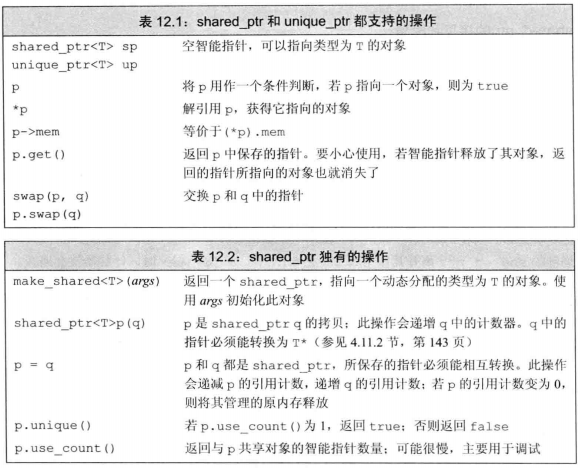
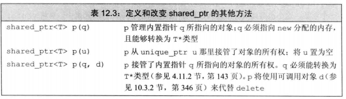
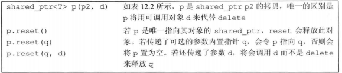
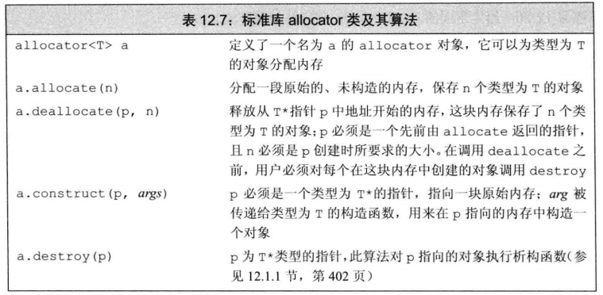
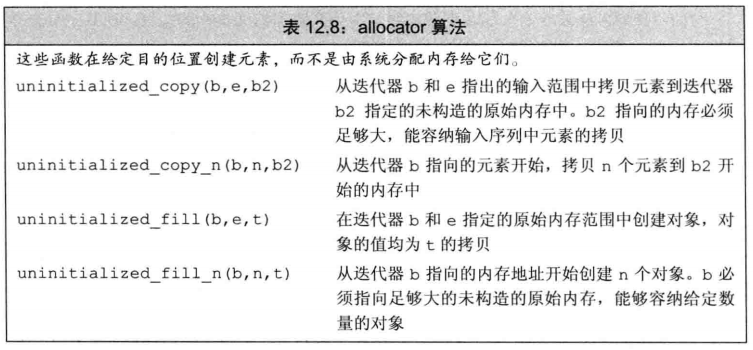

<!-- TOC -->

- [C++ Primer](#c-primer)
    - [第二章 变量和基本类型](#%E7%AC%AC%E4%BA%8C%E7%AB%A0-%E5%8F%98%E9%87%8F%E5%92%8C%E5%9F%BA%E6%9C%AC%E7%B1%BB%E5%9E%8B)
                - [当我们付给带符号类型一个超出他的范围的值时，结果是未定义的。（p33）](#%E5%BD%93%E6%88%91%E4%BB%AC%E4%BB%98%E7%BB%99%E5%B8%A6%E7%AC%A6%E5%8F%B7%E7%B1%BB%E5%9E%8B%E4%B8%80%E4%B8%AA%E8%B6%85%E5%87%BA%E4%BB%96%E7%9A%84%E8%8C%83%E5%9B%B4%E7%9A%84%E5%80%BC%E6%97%B6%EF%BC%8C%E7%BB%93%E6%9E%9C%E6%98%AF%E6%9C%AA%E5%AE%9A%E4%B9%89%E7%9A%84%E3%80%82%EF%BC%88p33%EF%BC%89)
        - [左值和右值](#%E5%B7%A6%E5%80%BC%E5%92%8C%E5%8F%B3%E5%80%BC)
        - [声明和定义](#%E5%A3%B0%E6%98%8E%E5%92%8C%E5%AE%9A%E4%B9%89)
        - [引用和const和指针](#%E5%BC%95%E7%94%A8%E5%92%8Cconst%E5%92%8C%E6%8C%87%E9%92%88)
        - [类型别名`typedef`和`using`](#%E7%B1%BB%E5%9E%8B%E5%88%AB%E5%90%8Dtypedef%E5%92%8Cusing)
    - [Chapter 7 类](#chapter-7-%E7%B1%BB)
            - [成员函数](#%E6%88%90%E5%91%98%E5%87%BD%E6%95%B0)
                - [引入this](#%E5%BC%95%E5%85%A5this)
                - [Notes: const指针和指针常量(P56)](#notes-const%E6%8C%87%E9%92%88%E5%92%8C%E6%8C%87%E9%92%88%E5%B8%B8%E9%87%8Fp56)
            - [const 成员函数](#const-%E6%88%90%E5%91%98%E5%87%BD%E6%95%B0)
            - [类的作用域和成员函数](#%E7%B1%BB%E7%9A%84%E4%BD%9C%E7%94%A8%E5%9F%9F%E5%92%8C%E6%88%90%E5%91%98%E5%87%BD%E6%95%B0)
            - [定义类相关的非成员函数](#%E5%AE%9A%E4%B9%89%E7%B1%BB%E7%9B%B8%E5%85%B3%E7%9A%84%E9%9D%9E%E6%88%90%E5%91%98%E5%87%BD%E6%95%B0)
            - [构造函数](#%E6%9E%84%E9%80%A0%E5%87%BD%E6%95%B0)
                - [构造函数初始值列表](#%E6%9E%84%E9%80%A0%E5%87%BD%E6%95%B0%E5%88%9D%E5%A7%8B%E5%80%BC%E5%88%97%E8%A1%A8)
                - [成员初始化顺序](#%E6%88%90%E5%91%98%E5%88%9D%E5%A7%8B%E5%8C%96%E9%A1%BA%E5%BA%8F)
                - [默认实参](#%E9%BB%98%E8%AE%A4%E5%AE%9E%E5%8F%82)
                - [委托构造函数](#%E5%A7%94%E6%89%98%E6%9E%84%E9%80%A0%E5%87%BD%E6%95%B0)
        - [访问控制与封装](#%E8%AE%BF%E9%97%AE%E6%8E%A7%E5%88%B6%E4%B8%8E%E5%B0%81%E8%A3%85)
            - [友元](#%E5%8F%8B%E5%85%83)
                - [类之间的友元](#%E7%B1%BB%E4%B9%8B%E9%97%B4%E7%9A%84%E5%8F%8B%E5%85%83)
                - [令成员函数作为友元](#%E4%BB%A4%E6%88%90%E5%91%98%E5%87%BD%E6%95%B0%E4%BD%9C%E4%B8%BA%E5%8F%8B%E5%85%83)
            - [令成员作为内联函数](#%E4%BB%A4%E6%88%90%E5%91%98%E4%BD%9C%E4%B8%BA%E5%86%85%E8%81%94%E5%87%BD%E6%95%B0)
            - [可变数据成员](#%E5%8F%AF%E5%8F%98%E6%95%B0%E6%8D%AE%E6%88%90%E5%91%98)
            - [常量成员函数返回*this](#%E5%B8%B8%E9%87%8F%E6%88%90%E5%91%98%E5%87%BD%E6%95%B0%E8%BF%94%E5%9B%9Ethis)
            - [基于const的重载](#%E5%9F%BA%E4%BA%8Econst%E7%9A%84%E9%87%8D%E8%BD%BD)
            - [Forward declaration](#forward-declaration)
        - [类的静态成员](#%E7%B1%BB%E7%9A%84%E9%9D%99%E6%80%81%E6%88%90%E5%91%98)
            - [声明静态成员](#%E5%A3%B0%E6%98%8E%E9%9D%99%E6%80%81%E6%88%90%E5%91%98)
            - [使用类的静态成员](#%E4%BD%BF%E7%94%A8%E7%B1%BB%E7%9A%84%E9%9D%99%E6%80%81%E6%88%90%E5%91%98)
            - [定义静态成员](#%E5%AE%9A%E4%B9%89%E9%9D%99%E6%80%81%E6%88%90%E5%91%98)
    - [Chapter 13 搞清楚什么是拷贝/赋值拷贝/析构/三五法则/移动构造函数?](#chapter-13-%E6%90%9E%E6%B8%85%E6%A5%9A%E4%BB%80%E4%B9%88%E6%98%AF%E6%8B%B7%E8%B4%9D%E8%B5%8B%E5%80%BC%E6%8B%B7%E8%B4%9D%E6%9E%90%E6%9E%84%E4%B8%89%E4%BA%94%E6%B3%95%E5%88%99%E7%A7%BB%E5%8A%A8%E6%9E%84%E9%80%A0%E5%87%BD%E6%95%B0)
        - [什么是拷贝? 深拷贝? 浅拷贝?](#%E4%BB%80%E4%B9%88%E6%98%AF%E6%8B%B7%E8%B4%9D-%E6%B7%B1%E6%8B%B7%E8%B4%9D-%E6%B5%85%E6%8B%B7%E8%B4%9D)
            - [[1]Notes: 对比`push`和`emplace`成员函数.](#1notes-%E5%AF%B9%E6%AF%94push%E5%92%8Cemplace%E6%88%90%E5%91%98%E5%87%BD%E6%95%B0)
        - [拷贝赋值运算符](#%E6%8B%B7%E8%B4%9D%E8%B5%8B%E5%80%BC%E8%BF%90%E7%AE%97%E7%AC%A6)
        - [析构函数](#%E6%9E%90%E6%9E%84%E5%87%BD%E6%95%B0)
            - [析构函数完成什么工作?什么时候调用?](#%E6%9E%90%E6%9E%84%E5%87%BD%E6%95%B0%E5%AE%8C%E6%88%90%E4%BB%80%E4%B9%88%E5%B7%A5%E4%BD%9C%E4%BB%80%E4%B9%88%E6%97%B6%E5%80%99%E8%B0%83%E7%94%A8)
        - [三/五法则](#%E4%B8%89%E4%BA%94%E6%B3%95%E5%88%99)
        - [拷贝控制和资源管理](#%E6%8B%B7%E8%B4%9D%E6%8E%A7%E5%88%B6%E5%92%8C%E8%B5%84%E6%BA%90%E7%AE%A1%E7%90%86)
            - [**1. 行为像值的类**](#1-%E8%A1%8C%E4%B8%BA%E5%83%8F%E5%80%BC%E7%9A%84%E7%B1%BB)
            - [**2. 行为像指针的类**](#2-%E8%A1%8C%E4%B8%BA%E5%83%8F%E6%8C%87%E9%92%88%E7%9A%84%E7%B1%BB)
        - [动态内存管理类](#%E5%8A%A8%E6%80%81%E5%86%85%E5%AD%98%E7%AE%A1%E7%90%86%E7%B1%BB)
                - [实现](#%E5%AE%9E%E7%8E%B0)
        - [对象移动](#%E5%AF%B9%E8%B1%A1%E7%A7%BB%E5%8A%A8)
            - [右值引用](#%E5%8F%B3%E5%80%BC%E5%BC%95%E7%94%A8)
            - [标准库move函数](#%E6%A0%87%E5%87%86%E5%BA%93move%E5%87%BD%E6%95%B0)
            - [移动构造函数和移动赋值运算符](#%E7%A7%BB%E5%8A%A8%E6%9E%84%E9%80%A0%E5%87%BD%E6%95%B0%E5%92%8C%E7%A7%BB%E5%8A%A8%E8%B5%8B%E5%80%BC%E8%BF%90%E7%AE%97%E7%AC%A6)
                - [移后源对象必须可析构](#%E7%A7%BB%E5%90%8E%E6%BA%90%E5%AF%B9%E8%B1%A1%E5%BF%85%E9%A1%BB%E5%8F%AF%E6%9E%90%E6%9E%84)
                - [合成的移动操作](#%E5%90%88%E6%88%90%E7%9A%84%E7%A7%BB%E5%8A%A8%E6%93%8D%E4%BD%9C)
                - [移动右值,拷贝左值....](#%E7%A7%BB%E5%8A%A8%E5%8F%B3%E5%80%BC%E6%8B%B7%E8%B4%9D%E5%B7%A6%E5%80%BC)
                - [但没有移动构造函数,右值也被拷贝...](#%E4%BD%86%E6%B2%A1%E6%9C%89%E7%A7%BB%E5%8A%A8%E6%9E%84%E9%80%A0%E5%87%BD%E6%95%B0%E5%8F%B3%E5%80%BC%E4%B9%9F%E8%A2%AB%E6%8B%B7%E8%B4%9D)
                - [右值引用和成员函数](#%E5%8F%B3%E5%80%BC%E5%BC%95%E7%94%A8%E5%92%8C%E6%88%90%E5%91%98%E5%87%BD%E6%95%B0)
    - [Chapter 12 动态内存](#chapter-12-%E5%8A%A8%E6%80%81%E5%86%85%E5%AD%98)
        - [动态内存和智能指针](#%E5%8A%A8%E6%80%81%E5%86%85%E5%AD%98%E5%92%8C%E6%99%BA%E8%83%BD%E6%8C%87%E9%92%88)
            - [shared_ptr类](#sharedptr%E7%B1%BB)
                - [make_shared 函数](#makeshared-%E5%87%BD%E6%95%B0)
                - [`shared_ptr`的拷贝和赋值](#sharedptr%E7%9A%84%E6%8B%B7%E8%B4%9D%E5%92%8C%E8%B5%8B%E5%80%BC)
                - [shared_ptr自动销毁所管理的对象......](#sharedptr%E8%87%AA%E5%8A%A8%E9%94%80%E6%AF%81%E6%89%80%E7%AE%A1%E7%90%86%E7%9A%84%E5%AF%B9%E8%B1%A1)
                - [......shared_ptr还会自动释放相关联的内存](#sharedptr%E8%BF%98%E4%BC%9A%E8%87%AA%E5%8A%A8%E9%87%8A%E6%94%BE%E7%9B%B8%E5%85%B3%E8%81%94%E7%9A%84%E5%86%85%E5%AD%98)
                - [使用动态生存期的资源的类](#%E4%BD%BF%E7%94%A8%E5%8A%A8%E6%80%81%E7%94%9F%E5%AD%98%E6%9C%9F%E7%9A%84%E8%B5%84%E6%BA%90%E7%9A%84%E7%B1%BB)
            - [直接管理内存](#%E7%9B%B4%E6%8E%A5%E7%AE%A1%E7%90%86%E5%86%85%E5%AD%98)
                - [使用new动态分配和初始化对象](#%E4%BD%BF%E7%94%A8new%E5%8A%A8%E6%80%81%E5%88%86%E9%85%8D%E5%92%8C%E5%88%9D%E5%A7%8B%E5%8C%96%E5%AF%B9%E8%B1%A1)
                - [动态分配的const对象](#%E5%8A%A8%E6%80%81%E5%88%86%E9%85%8D%E7%9A%84const%E5%AF%B9%E8%B1%A1)
                - [释放动态内存](#%E9%87%8A%E6%94%BE%E5%8A%A8%E6%80%81%E5%86%85%E5%AD%98)
                - [[2]内存分区问题注释](#2%E5%86%85%E5%AD%98%E5%88%86%E5%8C%BA%E9%97%AE%E9%A2%98%E6%B3%A8%E9%87%8A)
                - [delete之后重置指针值...](#delete%E4%B9%8B%E5%90%8E%E9%87%8D%E7%BD%AE%E6%8C%87%E9%92%88%E5%80%BC)
            - [`shared_ptr`和`new`一起使用](#sharedptr%E5%92%8Cnew%E4%B8%80%E8%B5%B7%E4%BD%BF%E7%94%A8)
                - [不要混合使用普通指针和智能指针](#%E4%B8%8D%E8%A6%81%E6%B7%B7%E5%90%88%E4%BD%BF%E7%94%A8%E6%99%AE%E9%80%9A%E6%8C%87%E9%92%88%E5%92%8C%E6%99%BA%E8%83%BD%E6%8C%87%E9%92%88)
                - [也不要使用get初始化另一个智能指针或为智能指针赋值](#%E4%B9%9F%E4%B8%8D%E8%A6%81%E4%BD%BF%E7%94%A8get%E5%88%9D%E5%A7%8B%E5%8C%96%E5%8F%A6%E4%B8%80%E4%B8%AA%E6%99%BA%E8%83%BD%E6%8C%87%E9%92%88%E6%88%96%E4%B8%BA%E6%99%BA%E8%83%BD%E6%8C%87%E9%92%88%E8%B5%8B%E5%80%BC)
                - [其他shared_ptr操作](#%E5%85%B6%E4%BB%96sharedptr%E6%93%8D%E4%BD%9C)
            - [智能指针和异常](#%E6%99%BA%E8%83%BD%E6%8C%87%E9%92%88%E5%92%8C%E5%BC%82%E5%B8%B8)
                - [使用自己的释放操作(deleter)](#%E4%BD%BF%E7%94%A8%E8%87%AA%E5%B7%B1%E7%9A%84%E9%87%8A%E6%94%BE%E6%93%8D%E4%BD%9Cdeleter)
            - [`unique_ptr`](#uniqueptr)
                - [向`unique_ptr`传递`deleter`](#%E5%90%91uniqueptr%E4%BC%A0%E9%80%92deleter)
            - [`weak_ptr`](#weakptr)
            - [allocator类](#allocator%E7%B1%BB)
                - [allocator 分配未构造的内存](#allocator-%E5%88%86%E9%85%8D%E6%9C%AA%E6%9E%84%E9%80%A0%E7%9A%84%E5%86%85%E5%AD%98)
                - [拷贝和填充未初始化内存的算法](#%E6%8B%B7%E8%B4%9D%E5%92%8C%E5%A1%AB%E5%85%85%E6%9C%AA%E5%88%9D%E5%A7%8B%E5%8C%96%E5%86%85%E5%AD%98%E7%9A%84%E7%AE%97%E6%B3%95)
            - [文本查询程序](#%E6%96%87%E6%9C%AC%E6%9F%A5%E8%AF%A2%E7%A8%8B%E5%BA%8F)
                - [Notes: 使用using与typedef来定义的区别](#notes-%E4%BD%BF%E7%94%A8using%E4%B8%8Etypedef%E6%9D%A5%E5%AE%9A%E4%B9%89%E7%9A%84%E5%8C%BA%E5%88%AB)
    - [Chapter 14 重载运算符和类型转换](#chapter-14-%E9%87%8D%E8%BD%BD%E8%BF%90%E7%AE%97%E7%AC%A6%E5%92%8C%E7%B1%BB%E5%9E%8B%E8%BD%AC%E6%8D%A2)
        - [基本概念](#%E5%9F%BA%E6%9C%AC%E6%A6%82%E5%BF%B5)
                - [使用与内置类型一致的含义](#%E4%BD%BF%E7%94%A8%E4%B8%8E%E5%86%85%E7%BD%AE%E7%B1%BB%E5%9E%8B%E4%B8%80%E8%87%B4%E7%9A%84%E5%90%AB%E4%B9%89)
                - [赋值和复合赋值运算符](#%E8%B5%8B%E5%80%BC%E5%92%8C%E5%A4%8D%E5%90%88%E8%B5%8B%E5%80%BC%E8%BF%90%E7%AE%97%E7%AC%A6)
                - [当我们定义重载运算符时,必须首先决定是将其声明为类的成员函数还是非成员函数.](#%E5%BD%93%E6%88%91%E4%BB%AC%E5%AE%9A%E4%B9%89%E9%87%8D%E8%BD%BD%E8%BF%90%E7%AE%97%E7%AC%A6%E6%97%B6%E5%BF%85%E9%A1%BB%E9%A6%96%E5%85%88%E5%86%B3%E5%AE%9A%E6%98%AF%E5%B0%86%E5%85%B6%E5%A3%B0%E6%98%8E%E4%B8%BA%E7%B1%BB%E7%9A%84%E6%88%90%E5%91%98%E5%87%BD%E6%95%B0%E8%BF%98%E6%98%AF%E9%9D%9E%E6%88%90%E5%91%98%E5%87%BD%E6%95%B0)
        - [输入输出运算符](#%E8%BE%93%E5%85%A5%E8%BE%93%E5%87%BA%E8%BF%90%E7%AE%97%E7%AC%A6)
            - [重载输出运算符<<](#%E9%87%8D%E8%BD%BD%E8%BE%93%E5%87%BA%E8%BF%90%E7%AE%97%E7%AC%A6)
                - [输入输出必须是非成员函数](#%E8%BE%93%E5%85%A5%E8%BE%93%E5%87%BA%E5%BF%85%E9%A1%BB%E6%98%AF%E9%9D%9E%E6%88%90%E5%91%98%E5%87%BD%E6%95%B0)
                - [重载输入运算符>>](#%E9%87%8D%E8%BD%BD%E8%BE%93%E5%85%A5%E8%BF%90%E7%AE%97%E7%AC%A6)
        - [算术和关系运算符](#%E7%AE%97%E6%9C%AF%E5%92%8C%E5%85%B3%E7%B3%BB%E8%BF%90%E7%AE%97%E7%AC%A6)
        - [赋值运算符](#%E8%B5%8B%E5%80%BC%E8%BF%90%E7%AE%97%E7%AC%A6)
        - [下标运算符`operator[]`](#%E4%B8%8B%E6%A0%87%E8%BF%90%E7%AE%97%E7%AC%A6operator)
        - [递增和递减运算符](#%E9%80%92%E5%A2%9E%E5%92%8C%E9%80%92%E5%87%8F%E8%BF%90%E7%AE%97%E7%AC%A6)
            - [定义前置](#%E5%AE%9A%E4%B9%89%E5%89%8D%E7%BD%AE)
            - [区分前置和后置运算符](#%E5%8C%BA%E5%88%86%E5%89%8D%E7%BD%AE%E5%92%8C%E5%90%8E%E7%BD%AE%E8%BF%90%E7%AE%97%E7%AC%A6)
        - [成员访问运算符`*`和`->`](#%E6%88%90%E5%91%98%E8%AE%BF%E9%97%AE%E8%BF%90%E7%AE%97%E7%AC%A6%E5%92%8C)
        - [函数调用运算符](#%E5%87%BD%E6%95%B0%E8%B0%83%E7%94%A8%E8%BF%90%E7%AE%97%E7%AC%A6)
            - [lambda是函数对象](#lambda%E6%98%AF%E5%87%BD%E6%95%B0%E5%AF%B9%E8%B1%A1)
            - [可调用对象与function](#%E5%8F%AF%E8%B0%83%E7%94%A8%E5%AF%B9%E8%B1%A1%E4%B8%8Efunction)
                - [不同类型可能具有相同的调用形式](#%E4%B8%8D%E5%90%8C%E7%B1%BB%E5%9E%8B%E5%8F%AF%E8%83%BD%E5%85%B7%E6%9C%89%E7%9B%B8%E5%90%8C%E7%9A%84%E8%B0%83%E7%94%A8%E5%BD%A2%E5%BC%8F)
                - [标准库function类型](#%E6%A0%87%E5%87%86%E5%BA%93function%E7%B1%BB%E5%9E%8B)
    - [Chapter 15 面向对象程序设计](#chapter-15-%E9%9D%A2%E5%90%91%E5%AF%B9%E8%B1%A1%E7%A8%8B%E5%BA%8F%E8%AE%BE%E8%AE%A1)
        - [基类](#%E5%9F%BA%E7%B1%BB)
        - [派生类](#%E6%B4%BE%E7%94%9F%E7%B1%BB)
            - [派生类对象及派生类向基类的类型转换](#%E6%B4%BE%E7%94%9F%E7%B1%BB%E5%AF%B9%E8%B1%A1%E5%8F%8A%E6%B4%BE%E7%94%9F%E7%B1%BB%E5%90%91%E5%9F%BA%E7%B1%BB%E7%9A%84%E7%B1%BB%E5%9E%8B%E8%BD%AC%E6%8D%A2)
            - [派生类的构造函数](#%E6%B4%BE%E7%94%9F%E7%B1%BB%E7%9A%84%E6%9E%84%E9%80%A0%E5%87%BD%E6%95%B0)

<!-- /TOC -->
# C++ Primer

**路漫漫其修远兮，吾将上下而求索。----2018.4.28 夜**


## 第二章 变量和基本类型

##### 当我们付给带符号类型一个超出他的范围的值时，结果是未定义的。（p33）
### 左值和右值
* **左值可以出现在赋值语句的左边或右边。**
* 右值只能出现在赋值的右边，不能出现在赋值语句的左边。
变量是左值，因此可以出现在赋值语句的左边。数字字面值是右值，因此不能被赋值。
### 声明和定义
* 变量的定义用于为变量分配存储空间，还可以为变量指定初始值。在一个程序中，变量有且仅有一个定义。
* 声明用于向程序表明变量的类型和名字。定义也是声明：当定义变量时我们声明了它的类型和名字。可以通过使用 extern 关键字声明变量名而不定义它。不定义变量的声明包括对象名、对象类型和对象类型前的关键字`extern`
    ```c
    extern int i; // declares but does not define i
    int i; // declares and defines i
    ```
* extern 声明不是定义，也不分配存储空间。事实上，它只是说明变量定义在程序的其他地方。程序中变量可以声明多次，但只能定义一次。
### 引用和const和指针
* 当引用初始化后，只要该引用存在，它就保持绑定到初始化时指向的对象。不可能将引用再绑定到另一个对象。
* 空指针：生成空指针：`int p=nullptr`
* `void*`:可以存放任意对象的地址，但是我们不知道是什么样的类型的对象。
* 指向指针的引用。
    ```c
    int i=42;
    int *p;
    int *&r=p;

    r=&i;//相当于p指向i
    *r=0;
    ```
要理解r到底是什么，最简单的办法是从右向左阅读r的定义。因此上一个r是一个引用。应用的是一个指针，最后数据类型是int。
* `constexpr`:常量表达式是指值不会改变并且在编译过程中就能得到结果。
    ```c++
    constexpr int mf=20;//20是常量表达式
    constexpr int limit=mf+1;
    constexpr int sz=size(); //只有当size()是constexpr函数时，才正确！
    ```
* 如果你认为变量是一个常量表达式，那就把它声明为`constexpr`.

### 类型别名`typedef`和`using`
 `typedef double wages;` 
 `using SI=Sale_Item;`


## Chapter 7 类

> 成员函数如何获取成员变量所依赖的对象呢? const成员函数?

#### 成员函数

##### 引入this 

* 当我们在调用成员函数时候,实际上是在替某个对象调用它.
* 成员函数通过一个名为`this`的额外的隐式参数来访问调用他的那个对象.当我们在调用一个成员函数时,用请求该函数的**对象地址**初始化`this`.
* 任何对类成员的直接访问都被看做`this`的隐式引用.
* `this`的目的总是指向"这个"对象,所以`this`是一个**常量指针**,**我们不允许改变`this`中保存的地址.**

##### Notes: const指针和指针常量(P56)

> const 指针

指针是对象而引用不是,因此就像其他对象类型一样,允许把指针本身定义为常量.

* 常量指针必须初始化,而且初始化一旦完成,则他的值(也就是存放在指针中的那个地址)就不能再变了.**把`*`放在关键字`const`之前说明指针是一个常量**,即不变的是指针本身的值而非指向的那个值.

* 指针本身是一个常量并不意味着不能通过指针修改其所指的对象的值.

  ```c++
  int num1=0;
  int *const num2=&num1;//num2一直指向num1
  const double pi=3.1415;
  const double *const pip=&pi;//pip是一个指向常量对象的常量指针
  //从右往左:
  //const: num2 是一个常量对象; *: 这个对象是指针,所有是常量指针. int :常量指针指向一个int对象.
  //pip 是一个常量指针,指向一个double对象
  ```

> 指向常量的指针

* 不能用于改变其所指对象的值.

* 把`*`放在关键字`const`之后.

  ```c++
  const double pi=3.14;
  const double *cptr=&pi;
  ```

#### const 成员函数

> `const`的作用就是修改隐式`this`指针的类型.默认情况下,`this`的类型是指向**非常量**版本的**常量指针**.尽管`this`是隐式的,但是常量指针必须需要初始化,仍需要遵守初始化规则,意味着(在默认情况下)我们不能把`this` 绑定到一个常量对象上.**这一情况也使得我们不能在一个常量对象上调用普通成员函数.**

在哪里将this声明成指向常量的指针? C++允许我们将const放在成员函数的参数列表之后.伪代码:

```c++
std::string Sales_Data::isbn(const Sales_data *const this)
{return this->isbn;}
```

> **常量对象,以及常量对象的引用或者指针都只能调用常量成员函数.**

#### 类的作用域和成员函数

值得注意的是,成员变量定义在成员函数之后,成员函数也是可以成员变量的.

```c++
stding isbn()const {return bookNo;}
```

因为编译器分两步走,首先编译成员的声明,然后轮到成员函数体(如果有的话).因此,成员函数体可以随意使用类的其他成员而无需主要出现的顺序.

在类外定义,如果成员被声明为常量成员函数,那么他的定义也必须在参数列表后明确指定const属性.

#### 定义类相关的非成员函数

#### 构造函数

* 默认构造函数:无需任何实参,如果我们没有定义构造函数,编译器会为我们隐式地定义一个**合成默认构造函数**.
* 当类没有声明任何构造函数,编译器才会帮我们生成默认构造函数.
* 如果定义在块中的内置类型或复合类型(比如数组和指针)的对象被默认初始化,则他们的值是未定义的.
* **如果类里包含其他类的类型成员,而这个类没有默认构造函数,那么无法初始化.**用户在定义构造函数的时候，也需要添加一个默认的构造函数，这样就不会造成编译报错。

> C++11新标准规定,可以为数据成员提供一个类内初始值.创建对象时,类内初始值将用于初始化数据成员.没有初始值的成员被默认初始化.(P65) 
>
> 类内初始值必须以符号`=`后者花括号的形式直接初始化.

```c++
struct Sales_data{
    //该函数不接受任何实参,所以是默认构造函数.可以根据类内的初始值对成员进行初始化.否则默认初始化.
    Sales_data()=default;//默认构造函数,可以实现 Sales_data sale_item;
    Sales_data(const std::string &s):bookNo(s){}
    //相当于 Sales_data(const std::string &s):bookNo(s),units_sold(0),revenue(0){}
    Sales_data(const std::string &s,unsigned n,double p):bookNo(s),units_sold(n),revenue(p*n){}
    
    std::string bookNo;
    unsigned units_sold=0;//类内初始值
    double revenue=0.0;//类内初始值
}
```

> 如果我们已经提供了一个构造函数,所以编译器不会自动生成默认构造函数.如果我们需要默认构造函数,**必须显式的把他声明出来**.在参数列表后面加上`=default`来要求编译器生成构造函数.其中可以出现在类的内部(内联的),也可以出现在类的外部.(不是内联).

##### 构造函数初始值列表

初始化和赋值.

```c++
string bar;//默认初始化为空string
bar="sss";//赋值
```

如果没有在构造函数的初始值列表中显式的初始化成员,**则该成员将在构造函数函数体执行之前执行默认初始化.**

有时可以忽略两者区别.但是,如果成员是const 或者是引用的话,必须将其初始化.

**建议使用构造函数初始值(初始值列表形式).**

```c++
class ConstRef{
public:
    ConstRef(int il){
        i=il;
        ci=il;//Error 不能给const赋值
        ri=i;//ri没有初始化
    }
private:
    int i;
    const int ci;
    int &ri;
}
//正确:
ConstRef::ConstRef(int il):i(il),ci(il),ri(i){}
```

##### 成员初始化顺序

成员初始化顺序与其在类中定义出现的顺序一致.如果后一个成员初始化需要前一个成员的值,就需要非常注意初始化顺序.**但是尽量避免这样的初始化.**

##### 默认实参

一个构造函数如果为所有的参数都提供了默认参数,则他实际上也定义了默认构造函数.

##### 委托构造函数

假如函数体里包含代码的话,先执行这些代码,然后控制权才会交还给委托者的函数体.

```c++
class Sales_data{
public:
    Sales_data(std::string s,unsigned cnt,double price):bookNo(s),units_sold(cnt),revenue(cnt*price){}//非委托
    Sales_data():Sales_data("",0,0){}//委托构造
    Sales_data(std::string s):sales_data(s,0,0){}//委托构造
}
```


#####　默认构造函数的作用

* 如果定义了构造函数,最好也定义一个默认构造函数.

```c++
Sales_data obj();//正确,定义了一个函数而不是对象.
if(ibj.isbn()==Primer_5th_ed.isbn())//所以,这里错误!
...;
Sales_data obj;//正确,obj是个默认初始化的对象.
```


### 访问控制与封装

> struct和class的区别在于默认的访问权限.私有/公有.

#### 友元

> 类可以允许其他类或者函数访问他的非公有成员,方法是令其他类或者函数成为他的友元(friend).一般可以将一些非成员函数声明成友元,来访问私有变量.

私有成员变量只能由1.该类的成员函数 2. 其他友元函数.访问. 也不能被该类的对象访问!

+ 友元声明只能出现在类定义的内部,友元不是类的成员,在类出现的位置不定.但最好在类开始或结束时集中声明.
+ 友元的声明,只是指定了访问的权限,而非一个普通意义的函数声明.还需要专门对函数声明一次.
+ 为了使友元对类的用户可见,我们通常把友元的声明与类的本身放置在一个头文件中.

##### 类之间的友元

> 类还可以把其他类定义成友元,也可以把其他类(之前定义过的)的成员函数定义成友元.

举个友元类的例子:

假设我们需要为Window_mgr添加一个名为clear的成员函数,需要清除Screen的内容,就需要访问Screen的私有变量.我们需要将Window_mgr指定成Screen的友元:

```c++
class Screen{
    //Window_mgr可以访问Screen的私有成员
    friend class Window_mgr;
    ...
}
class Window_mgr{
public:
    using ScreenIndex =std::vector<Screen>::size_type;
    void clear(ScreenIndex);
private:
    std::vector<Screen>screens{Screen(24,80,' ')};
};
void Window_mgr::clear(ScreenIndex i){
    Screen &s=screens[i];
    //能够访问Screen的私有成员
    s.contents=string(s.height*s.width,' ');
}
```

##### 令成员函数作为友元

```c++
class Screen{
    // Window_mgr类必须在Screen之前先声明
    friend void Window_mgr::clear(ScreenIndex);
};
```

#### 令成员作为内联函数

> 在类中,通常一些规模较小的函数适合与被声明为内联函数.**定义在类内部的成员函数是自动内联的**

#### 可变数据成员

> 我们希望能够改变一个数据成员,即使在一个const成员函数内.可以通过在变量声明中加入mutable关键字做到这一点.

```c++
class Screen{
public:
    void some_member()const;
private:
    mutable size_t access_ctr;
};
Screen::some_member()const{
    ++acess_ctr;
}
//尽管some_member是一个cosnt成员函数,但是他仍然可以改变access_ctr的值.
```

#### 常量成员函数返回*this

返回类型是const A&(常量引用),是一个常量,所以不能调用非常量的普通成员函数.

#### 基于const的重载

* 通过区分成员函数是否是const,我们可以对其重载.因为非常量版本的函数对于常量对象是不可用的.我们只能在一个常量对象上调用const成员函数.
* 虽然可以在非常量对象上调用常量版本的或者非常量版本,但显然此时非常量版本是一个更好的匹配.

#### Forward declaration

> C++的类可以进行前向声明。但是，仅仅进行前向声明而没有定义的类是不完整的，这样的类，**只能用于定义指针、引用、以及用于函数形参的指针和引用。**而不能定义对象(因为此时编译器只知道这是个类，还不知道这个类的大小有多大)，也不能访问类的对象，仍和形式的访问都允许(因为此时根本不知道有些什么成员)。等到类正式定义以后，就可以以各种方式使用该类了。


### 类的静态成员

#### 声明静态成员

> 我们通过在成员的声明之前加上关键字`static`使其与类关联在一起.静态成员可以是public或者private.类型可以是常量/引用/指针/类类型等等.

```c++
class Account{
public:
    void calculate(){amount+=amount*interestRate;}
    static double rate(){return interestRate;}
    static void rate(double);
private:
	std::string owner;
    double amount;
    static double interestRate;
    static double initRate();
}
```

类的静态成员存在于任何对象之外,对象中不包含任何与静态数据成员有关的数据.因此,每个Account对象将包含两个数据成员:owner和amount.只存在一个interestRate对象而且他被所有Account对象共享.

#### 使用类的静态成员

我们使用作用域运算符直接访问静态成员:

```c++
double r;
r=Account::rate();
Account ac1;
Account *ac2=&ac1;
r=ac1.rate();
r=ad2->rate();
```

#### 定义静态成员

我们可以在类的内部也可以在类的外部定义静态成员函数.当在类的外部定义时,不能重复static关键字,**该关键字只能出现在类的内部的声明语句:**

```c++
void Account::rate(double newRate){
    interestRate=newRate;
}
```

> 因为静态数据成员不属于类的任何一个对象,所以他们并不是在创建类的对象时被定义的.这意味着他们不是由类的构造函数初始化的.而且一般来说,我们不能在类的内部初始化静态成员.相反的,必须在类的外部定义和初始化每一个静态成员.(只能定义一次)

> ```c++
> double Account::interestRate=initRate();
> //从类名开始,这条语句的剩余部分就都位于类的作用域之内了.
> //因此我们可以直接用initRate()函数,虽然是私有的,但我们也能用来初始化interestRate
> ```

在类的静态函数成员中，只能访问类的静态数据成员，而不能访问类的实例数据成员，因为在调用静态函数成员时，可能还没有创建类的具体实例（对象）。

声明静态成员函数:`static int func();//定义的时候不需要static关键字 `

调用静态成员函数: 1.类名::静态成员函数  2.对象名.静态成员函数

与一般函数的区别:

* 非静态成员函数有this指针，静态成员函数没有this指针。
* 因为它可以在未定义类对象时就可以引用。因此静态成员函数不能访问本类中的非静态成员（没有this指针，就不能通过引用调用成员函数和数据成员）。
* 静态成员函数一般是为了处理静态的数据成员。
* 静态成员函数不可以调用类的非静态成员。因为静态成员函数不含this指针。静态成员函数不可以同时声明为   virtual、const、volatile函数   。

## Chapter 13 搞清楚什么是拷贝/赋值拷贝/析构/三五法则/移动构造函数?

> 拷贝控制操作:5种.

> 拷贝构造函数/拷贝赋值运算符/移动构造函数/移动赋值运算符/析构函数

### 什么是拷贝? 深拷贝? 浅拷贝?　

```c
class Foo{
    public:
    Foo();
    Foo(const Foo&);//拷贝构造函数
    ...
};
```

* 如果一个构造函数的第一个参数是自身类型的引用，且任何额外参数都有默认值，那么这就是拷贝构造函数．
* 如果一个类有一个移动构造函数，则拷贝初始化有时会使用移动构造函数而非拷贝构造函数来完成.
* **拷贝初始化**不仅在`=`定义变量时发生,在以下情况也会发生:(P441)
    * 将一个对象作为实参传递给一个非引用类型的形参  (传值)
    * 从一个返回类型为非引用类型的函数返回一个对象  (不是返回引用)
    * 用花括号列表初始化一个数组中的一个元素或一个聚合类中的成员
    * 当我们初始化STL容器或者调用`insert`或`push`成员时,也是拷贝初始化.相反,用`emplace`成员创建的元素都进行直接初始化.[1]
    
#### [1]Notes: 对比`push`和`emplace`成员函数.

* 向一个`vector deque string `插入元素会使所有指向容器的迭代器/引用和指针失效.(effective STL)
* 向一个`vector deque string `尾部以外插入元素,都需要移动元素;向`vector string`添加元素可能会导致整个对象存储空间的**重新分配**.(effective STL)
* 当我们用一个对象来初始化容器,或插入.实际放入容器的是对象值的拷贝,而不是对象本身.

`emplace`操作: `emplace_front`/ `emplace`/ `emplace_back`

当我们调用一个`emplace`成员函数时,直接将参数传递给元素类型的构造函数.`emplace`成员直接在容器管理的内存空间中直接构造元素.

```c
c.emplace_back("99-99",25,15.99);//直接构造sales_data对象     1
c.push_back("99-99",25,15.99);//错误!,不符合`push_back`参数   2
c.push_back(sales_data("99-99",25,15.99));//创建一个临时对象,在传递给push_back    3
```
其中 1,3 都会创建新的sales_data对象,在1中会直接在容器管理的内存空间中创建对象.而3 会创建临时对象,再压入容器中.

```c
c.emplace_back();//使用sales_data默认构造函数
c.emplace(iter,"99-99");//使用相对应的构造函数
```

    Notes: 传递给emplace函数的参数必须与元素类型的构造函数相匹配.
    push或insert是拷贝初始化;emplace是直接初始化.

### 拷贝赋值运算符

```c
class Foo{
    public:
    Foo();
    Foo& operator=(const Foo&);//赋值运算符
    ...
};
```
* 重载赋值运算符本质就是函数,`operator=`的函数,必须定义为成员函数.
    * 如果运算符是成员函数,其左侧运算对象就绑定到隐式的`this`参数
* 赋值运算符通常返回一个指向其坐车运算对象的引用.

### 析构函数

析构函数没有返回值,也不接受参数.因此不能被重载,一个类只有一个析构函数.

#### 析构函数完成什么工作?什么时候调用?

* 在构造函数中,成员初始化是在函数体执行之前完成的,且按照类先后定义的位置顺序进行初始化;一个析构函数先执行函数体,然后销毁成员.成员按初始化的逆序销毁.
* 内置类型没有析构函数,不需要销毁;如果`类`类型,需要执行自己的析构函数.
* 隐式销毁一个内置指针类型的成员不会delete他所指的对象.
* 什么时候会调用析构函数:
    * 变量离开其作用域
    * 当一个对象被销毁,其成员也被销毁
    * 容器被销毁,其元素也被销毁
    * 对于动态分配的对象,当对指向他的指针应用`delete`时被销毁.
    * 对于临时对象,当创建他的完整表达式结束时被销毁.

```c
{
    //新作用域
    sales_data *p =new sales_data;//p是一个内置指针
    auto p2=make_shared<sales_data>();//p2是一个shared_ptr
    sales_data item(*p);//拷贝构造函数将*p拷贝到item里
    vector<sales_data> vec;//局部变量vec
    vec.push_back(*p2);//拷贝P2所指的对象
    delete p;//对p指向的对象执行析构函数,如果没有这一步,不会被释放
}//退出局部作用域;对item,p2,vec调用析构函数
 //销毁p2会递减其引用次数,如果次数为0,对象被释放.本例中,次数为0,因此shared_ptr的析构函数会delete p2分配的sales_data对象
 //销毁vec,会销毁其内部元素
```

### 三/五法则
* **需要自定义析构函数的类也需要自定义拷贝和赋值操作**．
* **需要拷贝的操作也需要赋值操作,反之亦然**

如果这个类在构造函数中分配动态内存,合成析构函数不会delete一个指针数据成员,因此需要自定义一个析构函数释放构造函数分配的内存.并且,**他还需要一个拷贝构造函数和拷贝赋值运算符**.
```c
class HasPtr{
public:
    HasPtr(const std::string &s=std::string()):
    ps(new std::string(s),i(0)) { }
    ~HasPtr(){
        delete ps;
    }
private:
    std::string *ps;
    int i;
};
```
在这个版本的类定义中,构造函数中分配的内存将在HasPtr对象销毁时被释放.**但是**,会引入严重的错误!这个版本的类使用了合成拷贝构造和拷贝赋值运算符.这些函数简单拷贝指针成员,意味着多个HasPtr对象可能指向相同的内存:
```c
HasPtr f(HasPtr hp){//HasPtr是传值参数,所以将被拷贝
    HasPtr ret=hp;//拷贝给指定的HasPtr
    return ret;//ret和hp都会被销毁
}
```
当f返回时,ret和hp都会被销毁,在两个对象都会调用HasPtr的析构函数.会delete ret和hp中的指针成员.但是两个对象包含相同的指针值,代码会导致此指针被delete两次!--->未定义的行为!

此外,f的调用者还会使用传递给f的对象:

```c
HasPtr p("some");
f(p);//p.ps指向内存被释放!
HasPtr q(p);//现在p和q都指向无效内存!
```
其他:
* 使用`=default`,显式地要求编译器生成合成的版本;当我们在类内用`=default`声明时,--->声明为内联的.当我们不希望,应该只对成员的类外定义使用`=default`.**我们只能对默认构造函数或拷贝控制成员使用**.
* 阻止拷贝,例如iosstream类阻止了拷贝,避免多个对象写入或读取相同的IO缓冲.在函数参数列表后面加上`=delete`,定义删除的函数. **1. 我们可以对任何函数使用**. **2. 只能在函数第一次声明的时候使用**

```c
struct NoCopy{
    NoCopy()=default;//使用合成的默认构造函数
    NoCopy(const NoCopy&)=delete;
    NoCopy &operator=(const NoCopy&)=delete;
}
```

### 拷贝控制和资源管理

还是以上一个`HasPtr`类为例:
```c
class HasPtr{
public:
    HasPtr(const std::string &s=std::string()):
    ps(new std::string(s),i(0)) { }
    ~HasPtr(){
        delete ps;
    }
private:
    std::string *ps;
    int i;
};
```
#### **1. 行为像值的类**

为了提供类值的行为,对于类管理的资源,每一个对象都应该拥有一份自己的拷贝.则意味着对于ps指向的string,对于每一个HasPtr对象都必须有自己的拷贝.实现类值行为,HasPtr需要:

* 定义一个拷贝构造函数,完成对string的拷贝,而不是拷贝指针
* 定义一个析构函数释放string
* 定义一个拷贝赋值运算符来释放对象当前的string,并从右侧运算对象拷贝string

```c
    class HasPtr{
    public:
        HasPtr(const std::string &s=std::string()):
        ps(new std::string(s),i(0)) { }
        //对ps指向的string,每个HasPtr对象都有自己的拷贝
        HasPtr(const HasPtr& p):ps(new std::string(*p.ps),i(p.i)){}
        HasPtr& operator=(const HasPtr &);
        ~HasPtr(){
            delete ps;
        }
    private:
        std::string *ps;
        int i;
    };
```
接下来,类值拷贝赋值运算符:

赋值运算符通常组合了析构函数和构造函数的操作.
1. 类似析构函数,赋值操作会首先销毁左侧运算对象的资源(原来的值).
2. 类似拷贝构造函数,从右侧对象拷贝数据,但是要以正确的顺序执行.

```c
HasPtr& HasPtr::operator=(const HasPtr &rhs)
{
    auto newp=new string (*rhs.ps);
    delete ps;
    ps=newp;
    i=rhs.i;
    return *this;//返回本对象
}
```
Notes: 
1. 如果建一个对象赋予他自身,赋值运算符必须能正确工作.
2. 大多数赋值运算符组合了析构函数和拷贝构造函数的工作.
3. 一个好的模式是先将右侧对象拷贝到一个局部临时对象中;当拷贝完成后,销毁左侧运算对象的现有成员就是安全的了. 1.销毁左侧资源; 2.从临时对象拷贝到左侧.

以下是错误的:
```c
HasPtr& HasPtr::operator=(const HasPtr &rhs)
{
    //如果rhs和*this指向同一个对象,那就废了!(比如自己赋值给自己)
    delete ps;
    ps=new string (*(rhs.ps));
    i=rhs.i;
    return *this;//返回本对象
}
```
#### **2. 行为像指针的类**

令一个类展现类似指针的行为的最好办法是使用`shared_ptr`来管理类中的资源.拷贝(或赋值)一个`shared_ptr`会拷贝(或赋值)`shared_ptr`所指向的指针.

### 动态内存管理类

​	某些类需要在运行时分配可变大小的内存空间.可以通过使用标准容器来处理,但是并不是每个类都适用.有些类需要定义自己的拷贝控制成员来管理所分配的内存.

​	例如我们将实现标准库`vector`简化版本.我们不使用模板,我们只使用`string`.我们将使用一个`allocator`来获得原始内存(未构造的).我们将会在添加新元素时使用`construct`成员在原始内存里创建对象.类似的,当我们需要删除一个元素时,我们使用`destory`.

每个StrVec有三个**指针成员**指向其元素所使用的内存:

+ `elements`,指向分配的内存中的首元素
+ `first_free`,最后实际元素之后的位置
+ `cap`,指向分配的内存末尾之后的位置

除了这些指针外,还有一个名为`alloc`的静态成员,类型为`allocator<string>`.alloc成员会分配StrVec的内存.

我们还有4个工具函数:

+ `alloc_n_copy`会分配内存,并拷贝一个给定范围的元素
+ `free`会销毁构造的元素并释放内存
+ `chk_n_alloc`保证StrVec至少容纳一个新元素的空间.如果没有空间添加新元素,`chk_n_alloc`会调用`reallocate`来分配更多的内存.
+ `reallocate`在内存用完时分配新内存.

##### 实现

```c++
//vector类内存分配策略的简化实现
class StrVec{
public:
    StrVec():elements(nullptr),first_free(nullptr),cap(nullptr){}
    StrVec(const StrVec&);//copy construct
    StrVec& operator=(const StrVec&);//拷贝赋值运算符
    ~StrVec();
    void push_back(const std::string&);
    size_t size() const {return first_free-elements;}
    size_t capacity() const {return cap-elements;}
    std::string* begin() const {return elements;} 
    std::string* end() const {return first_free;} 
    ...
private:
    static std::allocator<std::string> alloc;//分配元素
    void chk_n_alloc(){
        if(size()==capacity()) reallocate();
    }
    std::pair<std::string*, std::string*> alloc_n_copy(const std::string*, const std::string* );
    void free();
    void reallocate();
    std::string* elements;
    std::string* first_free;
    std::string* cap;
}
//用construct构造元素
void StrVec::push_back(const string& s){
    chk_n_alloc();
    alloc.construct(first_free++,s);//递增
}
pair<string*, string*> StrVec::alloc_n_copy(const string* b, const string* e){
    auto data=alloc.allocate(e-b);//分配内存
    //初始化一个pair,该pair由data和...构成
    //data 指向分配内存的开始位置
    //uninitialized_copy(b,e,data):返回最后一个构造的下一个位置
    return {data,uninitialized_copy(b,e,data)};//从迭代器b到迭代器e之间的元素,全部拷贝到data里
}
void StrVec::free(){
    if(elements){//不能传给deallocate()一个空指针.
        //逆序销毁旧元素
        for(auto p=first_free;p!=elements;)
            alloc.destroy(--p);//destroy会执行string的析构函数.string的析构函数会释放自己的内存.
        alloc.deallocate(elements,cap-elements);
    }
}
//拷贝构造函数
StrVec::StrVec(const StrVec& s){
    auto newdata=allocate_n_copy(s.begin(),s.end());
    elements=newdata.first;
    first_free=cap=newdata.second;//cap==first_free,这也说明了,copy()可以用作shrink_to_fit()
}
//析构函数
StrVec::~StrVec(){
    free();
}
//拷贝赋值
StrVec& StrVec::operator=(const StrVec& s){
    auto newdata=allocate_n_copy(s.begin(),s.end());
    free();
    elements=newdata.first;
    first_free=cap=newdata.second;//cap==first_free,这也说明了,copy()可以用作shrink_to_fit()
    return *this;
}
//reallocate 函数
void StrVec::reallocate(){
    auto newcapacity=size()?2*size():1;
    auto newdata=alloc.allocate(newcapacity);
    auto dest=newdata;//指向新数组下一个空闲位置
    auto elem=elements;//指向旧数组下一个空闲位置
    for(size_t i=0;i!=size();++i)
        alloc.construct(dest++,std::move(*elem++));
    free();//一旦我们移动完元素就释放旧内存
    //更新我们的数据结构,执行新元素
    elements=newdata;
    first_free=dest;
    cap=elements+newcapacity;
}
```

* [c++: size_type与 size_t一些概念](https://blog.csdn.net/lzx_bupt/article/details/6558566)
* 拷贝过后,cap==first_free,这也说明了,copy()可以用作`shrink_to_fit()`.
* `std::move`:当`reallocate`在新内存中构造string时,他必须调用`move`来表示希望使用`string`的移动构造函数.如果漏掉了,我们默认使用拷贝构造.其次,一般我们不为`move`提供`using`声明(p706).


### 对象移动
标准库容器/string/shared_ptr类既支持移动也支持拷贝,IO类和unique_ptr类可以移动,但不支持拷贝.

#### 右值引用
为了支持移动操作,c++11加入了新的引用类型---右值引用(rvalue reference).所谓右值引用,即绑定到右值的引用.我们通过`&&`而不是`&`来获取右值.

* 右值引用只能绑定到一个将要销毁的对象,因此我们可以从绑定到右值引用的对象"窃取"状态.
* 左值引用不能绑定到要求要求转换的表达式,字面常量或是返回右值的表达式;而右值完全相反.
* 我们可以将一个右值引用绑定到这类表达式,但不能绑定到一个左值.

```c
int i=42;
int &r=i;
int &&rr=i;//错
int &&rr1=42;//对
int &&rr2=rr1;//错,表达式rr1是左值!
int &r2=i*42;//错
const int &r3=i*42;
int &&rr2=i*42;//对
```

#### 标准库move函数
虽然我们不能将一个右值引用直接绑定到一个左值上,当我们可以显示的将一个左值转换为对应的右值引用类型.
```c
int &&rr3=std::move(rr1);//ok
```
调用move以后,我们不能对移动后源对象的值做任何假设.

我们可以销毁一个移后源对象,也可以赋予他新值,但不能使用一个移后源对象的值.

#### 移动构造函数和移动赋值运算符

1. 移动构造函数
* 类似拷贝构造函数,移动构造函数的第一个参数是该类型的一个引用,右值引用.
* 除了完成资源移动,移动构造函数还必须确保移后源对象处于这样一个状态--销毁他是无害的.

```c
StrVec::StrVec(StrVec &&s) noexcept //不抛出任何异常
: elements(s.elements),first_free(s.first_free),cap(s.cap)
{
    s.elements=s.first_free=s.cap=nullptr;
}
```
为什么要加`noexcept`关键字?(P474)
* 不抛出异常的移动构造函数和移动赋值运算符必须标记为`noexcept`.

2. 移动赋值运算符

* 移动赋值运算符和移动构造函数/析构函数做的一样的工作.
* 因为包含移动构造函数的工作,所以也必须标记为`noexcept`.

```c
StrVec &StrVec::operator=(StrVec &&rhs) noexcept{
    if(this !=rhs){
        free();//释放已有元素
        elements=rhs.elements;
        first_free=rhs.first_free;
        cap=rhs.cap;
        rhs.elements=rhs.first_free=rhs.cap=nullptr;
    }
    return *this;
}
```
我们直接检查this指针与rhs的地址是否相同.如果相同,右侧与左侧运算对象指向相同的对象,我们不需要做任何事情.否则,我们释放左侧对象所使用的内存,并接管给定对象的内存.

##### 移后源对象必须可析构

比如上面StrVec类通过将移后源对象的指针设为nullptr来实现的.

##### 合成的移动操作

* 如果我们不声明自己的拷贝构造函数或拷贝赋值运算符,编译器总会为我们合成这些操作.但是,一个类定义了自己的拷贝构造函数/拷贝赋值运算符或者析构函数,编译器就不会为他**合成**移动构造函数和赋值付.
* 只有当一个类没有为自己定义任何版本的拷贝控制成员,且类的每个成员都可以移动时,编译器才会为他**合成**移动构造函数或移动赋值运算符.
* 编译器可以移动内置类型的成员,如果一个成员是类类型,且右相应的移动操作,也可以移动.(比如 string)
* 一个类定义了自己的移动构造函数/移动赋值运算符,则该类的合成拷贝函数和拷贝赋值运算符会定义成删除的.也就是说,定义了一个移动构造函数或移动赋值运算符的类必须也定义自己的拷贝操作.否则,这些成员默认地定义为删除的.

##### 移动右值,拷贝左值....

如果一个类既有移动构造也要拷贝构造,根据函数匹配规则来确定使用哪一个.
* 拷贝构造函数接受一个`const StrVec &`.
* 移动构造函数接受一个`StrVec &&`,因此只能用于实参是(非static)右值的情形:

```c
StrVec v1,v2;
v1=v2;//v2是左值,拷贝
StrVec getVec(istream &);//函数不是引用返回,返回类型都是右值(P202)
v2=getVec(cin);//getVec(cin)是一个右值
```
##### 但没有移动构造函数,右值也被拷贝...
如果一个类有一个可用的拷贝构造函数而没有移动构造函数,则对象是通过拷贝构造函数来**"移动"**的.

##### 右值引用和成员函数

```c
void push_back(const X&);//拷贝,绑定到任意类型的X
void push_back(X&&);//移动,只能绑定到类型X的可修改的右值

StrVec vec;
string s="some string ";
vec.push_back(s);//调用的是拷贝
vec.push_back("done");//调用的移动
```
差别在于实参是左值还是右值(从"done"创建临时的string)

## Chapter 12 动态内存

除了静态内存和栈内存,每个程序还拥有内存池.

+ 静态内存和栈内存:
  + 静态内存用来保存局部`static`对象/类`static`数据成员以及定义在任何函数之外的变量.
  + 栈内存用来保存定义在函数内部非`static`对象.
  + 分配在静态或者栈内存中的对象由编译器自动创建和销毁.
  + 对于栈对象只有在其定义的程序块运行时才存在.
  + `static`在使用之前分配,在程序结束时销毁.
+ 内存池:
  + 这部分内存被称为**自由空间或堆**.
  + 程序用堆来储存**动态分配**的对象,即在程序运行时分配的对象.
  + 动态对象的生存周期由程序来控制,也就是说,当动态对象不再使用了,我们的代码必须显式的销毁他们.

### 动态内存和智能指针

在C++中,动态内存的管理是通过一对运算符来完成的:`new`和`delete`.

* 忘记释放,会造成内存泄漏.
* 提前释放,会导致引用非法内存的指针.

新标准提供了两种智能指针类型来管理动态对象.(都定义在memory头文件里)

+ `shared_ptr`允许多个指针指向同一个对象
+ `unique_ptr`**独占**所指向的对象.
+ `weak_ptr`:伴随类,它是一种弱引用,指向`shared_ptr`所管理的对象.

#### shared_ptr类



```c++
shared_ptr<string> p1;
shared_ptr<vector<int>> p2;

//检查她是否为空
if(p1&&p1->empty())
    *p1="hi";//如果p1指向一个空string,建一个新值付给他
```

##### make_shared 函数

最安全的分配和使用动态内存的方法就是调用`make_shared`的标准函数.使用时,必须像`shared_ptr`一样指明类型.

```c++
shared_ptr<int> p3=make_shared<int>42;
shared_ptr<sting> p4=make_shared<string> (10,'9');//p4指向`999999999`的string
shared_ptr<int> p5=make_shared<int>();//默认初始化  内置类型  0
```

通常我们用`auto`定义一个对象来保存`make_shared`的结果.

```c++
auto p6=make_shared<vector<string>>();
```

##### `shared_ptr`的拷贝和赋值

当我们进行拷贝或者赋值时,每个`shared_ptr`都会记录有多少个其他`shared_ptr`指向相同的对象.

```C++
auto p=make_shared<int> 42; //此时p指向的对象只有一个引用者
auto q(p); //p和q指向同一个对象 2
```

当我们赋予一个`shared_ptr`新值或者销毁时(例如一个局部的`shared_ptr`离开其作用域时),计数器就会递减.一旦一个`shared_ptr`的计数器变为0,他就会自动释放自己所管理的对象:

```c++
auto r=make_shared<int> (42);//r指向的只有一个引用者
r=q;//递增q指向的对象的引用计数;递减r原来指向的对象的引用计数;r原来的对象没有引用者,自动释放.
```

##### shared_ptr自动销毁所管理的对象......

* shared_ptr的析构函数会递减它所指向的对象的引用计数.如果计数为0,shared_ptr的析构函数就会销毁对象,并释放它占用的内存.

##### ......shared_ptr还会自动释放相关联的内存

shared_ptr类会自动释放动态对象,这一特性使得动态内存的使用变得十分容易. 

```c++
//Foo类型的动态分配的对象,对象是通过一个类型为T的参数进行初始化
//factory返回一个shared_ptr,指向一个动态分配的对象
shared_ptr<Foo> factory(T arg){
    return make_shared<Foo>(arg);
    //由于返回的是shared_ptr,我们可以确保他分配的对象会在恰当的时候被释放.
}
```

例如:

```c++
void use_factory(T arg){
    shared_ptr<Foo> p=factory(arg);
    //当p离开作用域,p被销毁时,将递减其引用计数并检查是否为0.
    //p是唯一引用facyory返回的内存对象.所以,p指向的对象也被销毁.
}
```

但是,如果有其他shared_ptr也指向这块内存,他就不会被释放:

```c++
void use_factory(T arg){
    shared_ptr<Foo> p=factory(arg);
    return p;//返回p时,引用计数进行了递增操作  p的拷贝
    //p离开作用域,p销毁,但所指的对象不会.
}
```

Notes: 如果你将``shared_ptr存放在容器里,而后不再需要全部元素,而只使用其中一部分,要记得用`erase`删除不再需要的那些元素.

##### 使用动态生存期的资源的类

程序使用动态内存出于一下三种原因之一:

1. 程序不知道自己需要使用多少对象
2. 程序不知道所需对象的准确类型
3. 程序需要在多个对象间共享数据

我们将定义一个类,它使用动态内存是为了让多个对象能够共享数据.

```c++
class StrBlob{
public:
    typedef std::vector<std::string>::size_type size_type;
    StrBlob();
    StrBlob(std::initializer_list<std::string> il);//接受一个初始化器的花括号列表
    size_type size() const {return data->size();}
    bool empty() const {return data->empty();}
    void push_back(const std::string &t) {data->push_back(t);}
    void pop_back();
    std::string& front();
    std::string& back();
private:
    std::shared_ptr<std::vector<std::string>> data;
    void check(size_type i, const std::string &msg) const;
}

//构造函数
StrBlob::StrBlob():data(make_shared<std::vector<std::string>>()) { }
StrBlob::StrBlob(std::initializer_list<std::string> il):data(make_shared<std::vector<string>>(il)) { }
//check()
void StrBlob::check(size_type i, const std::string &msg) const{
    if(i>=data->size())
        throw out_of_range(msg);
}
//pop_back()
string& StrBlob::front(){
	check(0,"front on empty StrBlob!");
    return data->front();
}
```

#### 直接管理内存

##### 使用new动态分配和初始化对象

```c++
string *ps1=new string;//默认初始化为空 string
string *ps=new string();//值初始化为空string
int *pil=new int;  //默认初始化; *pil的值未定义
int *pi2=new int(); //值初始化为0;*pi2为0
```

##### 动态分配的const对象

一个动态分配的`const`对象必须初始化.

```c++
//new分配const对象是合法的:
const int *pci new const int(1024);
//分配并默认初始化一个const的空string
const string *pcs=new const string;
```

由于分配的对象是`const`的,`new`返回的指针是一个指向`const`的指针.

##### 释放动态内存

`delete`表达式也执行两个动作: 销毁给定的指针指向的对象;释放对应的内存.

传给`delete`的指针必须指向**动态分配的内存**,或者是一个**空指针**.

释放一块并非`new`分配的内存,或者将相同的指针值释放多次,其行为是未定义的:

```c++
int i,*pil=&i,*pi2=nullptr;
double *pd=new double(33),*pd2=pd;
delete i;//ERROR     i不是一个指针
delete pil;//ERROR   pil指向一个局部变量(不是动态分配的内存)
delete pd;// OK
delete pd2;//ERROR   pd2指向的内存已经被释放了
delete pi2; //OK     释放一个控制住总是没有错误的
const int *pci=new const int(1024);
delete pci;//OK 释放一个const 对象
```
* 执行`delete pil 和pd2`所产生的错误更具有潜在危害:通常情况下,编译器不能分辨一个指针指向的是静态还是动态的对象.
* 编译器也不能分辨一个指针所指向的内存是否已经释放.

对于通过内置指针类型来管理的内存,他直到被显式地释放之前一直存在.(不同于智能指针)

返回指向动态内存的指针(不是智能指针)的函数给其调用者增加了一个额外负担----调用者必须记得释放内存.

```c++
Foo* factory(T arg){
    return new Foo(arg);//调用者需要释放此内存
}
void use_factory(T arg){
    Foo *p=factory(arg);//使用*p但是不delete他
}//p离开了他的作用域,但是它所指向的内存并没有释放!
```

当一个指针离开其作用域时,他所指向的对象什么也没有发生.如果这个指针指向的动态内内存,那么内存将不会被释放!

接着,那怎么销毁内存呢?什么时候销毁?

一旦`use_factory`返回,程序就无法释放这块内存了.根据程序的逻辑,修正bug应该在`use_factory`中释放内存.

```c++
void use_factory(T arg){
    Foo *p=factory(arg);//p 局部变量 ,离开作用域就被销毁.
    delete p;
}
```

还有一种可能,我们其他代码需要使用`use_factory`所分配的对象,我们就应该修改此函数,让他返回一个指针,指向他的内存:

```c++
Foo* use_factory(T arg){
    Foo *p =factory(arg);
    //使用p
    return p;//调用者必须释放内存
}
```

##### [2]内存分区问题注释

**在C++中，内存分成5个区，他们分别是堆、栈、自由存储区、全局/静态存储区和常量存储区。**

+ 栈，就是那些由编译器在需要的时候分配，在不需要的时候自动清楚的变量的存储区。里面的变量通常是局部变量、函数参数等。
+ 堆，就是那些由`new`分配的内存块，他们的释放编译器不去管，由我们的应用程序去控制，一般一个`new`就要对应一个`delete`。如果程序员没有释放掉，那么在程序结束后，操作系统会自动回收。
+ 自由存储区，就是那些由`malloc`等分配的内存块，他和堆是十分相似的，不过它是用`free()`来结束自己的生命的。
+ 全局/静态存储区，**全局变量**和**静态变量**被分配到同一块内存中，在以前的C语言中，全局变量又分为初始化的和未初始化的，在C++里面没有这个区分了，他们共同占用同一块内存区。
+ 常量存储区，这是一块比较特殊的存储区，他们里面存放的是常量，不允许修改（当然，你要通过非正当手段也可以修改，而且方法很多）

```c++
//1. 返回局部变量本身 
//原因：返回值是拷贝值，局部变量的作用域为函数内部，函数执行结束，栈上的局部变量会销毁，内存释放。
int sum(int a, int b)
{
    int s=a+b;
    return s;
}
//正确 2.常量：
char* returnValue()  
{  
    char* str="HelloJacky";  
    return str;  
}  
//错误
char* returnValue()  
{  
    char str[]="HelloJacky";  ////str 为局部变量
    return str;  
} 
//正确  3. 静态局部变量
char* returnValue()  
{  
    static char str[]="HelloJacky";  
    return str;  
} 

//4. 堆内存中的局部变量 new
char* newMemory(int size)
{
    char* p=NULL;
    p=new char[size];
    cout<<&p<<endl;
    return p;
}

int main()
{
    char* p=newMemory(2);
    if(p!=NULL)
    {
        *p='a';
    }
    std::cout<<*p<<endl;
    cout<<&p<<endl;
    delete [] p;
    return 0;
}
```

小心:动态内存管理非常容易出错

1. 忘记delete内存.-->内存泄漏问题.因为他永远也不会将内存归还给自由空间.查找也非常困难,因为只有程序运行很长时间,真正耗尽内存时,才会检测到这种错误.
2. 使用已经释放掉的对象.只有在释放后的的指针置空,有时可以检查出这种错误.
3. 同一块内存释放两次.

##### delete之后重置指针值...

我们delete指针之后,指针值变得无效了.虽然指针已经无效,但还保存着动态内存的地址.-->`空悬指针`,即指向一块无效的内存. 需要重新赋值`nullptr`.

但是可能有多个指针指向相同的内存.在`delete`之后重置指针只对这个指针有效,对其他任何仍然指向(已释放)的内存的指针是没有作用的!

#### `shared_ptr`和`new`一起使用

我们可以使用new返回的指针来初始化智能指针:

接受指针参数的智能指针的构造函数是`explict`的,我们不能将一个内置指针隐式转换成一个智能指针.必须使用`直接初始化`形式(**不能用`=`:拷贝**):

```c++
shared_ptr<int> p1=new int(42);//ERROR 必须使用直接初始化的形式
shared_ptr<int> p2(new int(42));//OK
```

由于同样的原因,一个返回`shared_ptr`的函数不能在其返回语句隐式转换一个普通指针:

```c++
shared_ptr<int> clone(int p){
    return new int(p);//ERROR 
    return shared_ptr<int>(new int(p));//显式的用int*创建shared_ptr<int>
    return make_shared<int>(p);
}
```





##### 不要混合使用普通指针和智能指针

使用一个内置指针来访问智能指针所负责的对象是危险的,因为我们无法知道对象何时会被销毁.

##### 也不要使用get初始化另一个智能指针或为智能指针赋值

get():返回一个内置指针,指向智能指针管理的对象.

使用get返回的指针的代码不能`delete`此指针.

```c++
shared_ptr<int> p(new int(42));
int *q=p.get();//OK  
{
    shared_ptr<int> (q);
}//程序块结束,q被销毁,他指向的内存被释放
int foo=*p;//未定义.p指向的内存被释放
```

##### 其他shared_ptr操作

```c++
p=new int(1024);//ERROR
p.reset(new int(1024));//OK  p 指向一个新对象
```
与赋值类似,`reset`也会更新引用计数.`reset`成员经常与`unique`一起使用,来控制多个`shared_ptr`共享的对象.在改变底层对象之前,我们检查自己是否是当前对象仅有的用户.如果不是,还需要在改变之前制作一份新的拷贝:

```c++
if(!p.unique()){
    p.reset(new string(*P));//我们不是唯一用户,分配新的拷贝
}
*p+=newVal;//现在我们知道自己是唯一用户,可以改变对象的值

```

#### 智能指针和异常

```c++
void f(){
    shared_ptr<int> sp(new int(42));
    //这段代码抛出一个异常,且在f中未被捕获
};//函数结束时,shared_ptr自动释放内存

void f(){
    int *ip=new int(42);
    ////这段代码抛出一个异常,且在f中未被捕获
    delete ip;//退出之前,释放内存
}
```
如果在`new`和`delete`之间发生异常,且异常未被捕获,则内存就永远不会被释放了.在函数f之外没有指针指向这块内存,因此无法释放.

##### 使用自己的释放操作(deleter)

如果你使用的是智能指针管理的资源,而不是`new`分配的内存,记住传递给它一个`deleter`.

#### `unique_ptr`

一个`unique_ptr`拥有他所指的对象.与`shared_ptr`不同,某个时刻只能有一个`unique_ptr`指向一个给定对象.当`unique_ptr`被销毁时,它所指向的的对象也被销毁.

没有类似`make_shared`函数返回一个`unique_ptr`.我们只能绑定到一个`new`返回的指针上,且**必须**直接初始化.

```c++
unique_ptr<int> p1;
unique_ptr<int> p2(new int(42));
```

由于`unique_ptr`拥有对象,所以不支持普通的拷贝或赋值操作:

```c++
unique_ptr<string> p1(new string("more"));
unique_ptr<string> p2(p1);//ERROR
unique_ptr<string> p3;
p3=p2;//ERROR
```

虽然我们不能拷贝或赋值`unique_ptr`,但我们可以调用`reset`或`release`将指针所有权从一个(非const)的`unique_ptr`转移到另一个`unique_ptr`.

```c++
unique_ptr<string> p2(p1.release());//转移p2
unique_ptr<string> p3(new string("none"));
p2.reset(p3.release());//reset 释放了p2原来指向的内存,release转移
```

`release()`:  

+ 返回当前保存的`unique_ptr`指针,并且将其置空.因此,p2被初始化为p1原来保存的指针,而p1被置空.

+ 调用`release()`会切断他与原来对象的联系.

+ 返回的指针通常用来初始化另一个智能指针或赋值;如果不用另一个智能指针来保存`release`返回的指针,我们的程序就要负责资源的释放:

  ```c++
  p2.release();//ERROR  p2不会释放内存,而且我们失去了指针
  auto p=p2.release();//OK 但我们必须记得delete(p)
  ```

`reset()`:接受一个可选的指针参数,令`unique_ptr`重新指定给定的指针.如果不为空,原来的对象被释放.

#####　传递`unique_ptr`参数和返回`unique_ptr`

移动拷贝可以.

##### 向`unique_ptr`传递`deleter`

重载一个`unique_ptr`中的`deleter`会影响到`unique_ptr`类型以及如何构造该类型的对象.我们必须在尖括号里提供删除器类型.

#### `weak_ptr`

```c++
auto p =make_shared<int>(42);
weak_ptr<int> wp(p);//wp弱共享p;p的引用计数未改变
```

#### allocator类

`new`将内存分配和对象构造组合在一起;`delete`将内存释放和对象析构组合在一起.

标准库`allocator`类定义在头文件`memory`里,他帮我们将内存分配和对象构造分开.他提供了一种类型感知的内存分配方法,他分配的内存是原始的/未构造的.

类似`vector`,`allocator`是一个模板.为了定义一个`allocator`,我们必须指明对象类型.

根据给定的对象类型来确定恰当的内存大小和对齐位置:

```c++
allocator<string> alloc;
auto const p=alloc.allocate(n);//分配n个未初始化的string
```



##### allocator 分配未构造的内存

allocator 分配的内存是未构造的.我们按照需要在此内存中构造对象.在新标准库中,`construct`成员函数接受一个指针和0个或多个额外参数,在给定位置构造一个元素.额外参数用来初始化构造的对象.

```c++
auto q=p;//q指向最后构造的元素之后的位置
alloc.construct(q++);//*q为空字符串
alloc.construct(q++,10,'c');//*q为cccccccccc
allloc.construct(q++,"hi");//*q为hi
```


为了使用`allocator`返回的内存,我们必须用construct构造对象.使用未构造的内存,其行为是未定义的.

当我们用完每个对象后,必须对每个构造函数的元素调用`destroy`来销毁他们.函数`destroy`接受一个指针,对指向的对象执行析构函数.

```c++
while(q!=p)
    alloc.destory(--q);//释放我们真正构造的string
```

一旦元素被销毁后,就可以重新使用这部分内存来保存其他string,也可以将其归还给系统.释放内存通过调用`deallocate`来完成:

```C++
alloc.deallocate(p,n);//p不能为空,必须指向allocate分配的内存;n必须和分配时大小相同.
```
##### 拷贝和填充未初始化内存的算法



```c++
//分配比vi中元素空间大一倍的动态内存
auto p =alloc.allocate(vi.size()*2);
//通过拷贝元素来构造从p开始的元素
auto q=unitialized_copy(vi.begin(),vi.end(),p);
//将剩余元素初始化为42
unitialized_fill_n(q,vi.size(),42);
```

这块在第13章再次讲到.

#### 文本查询程序

```c++
class QueryResult;//为了定义函数query的返回类型,这个定义是必须的
class TextQuery{
public:
    using line_no=vector<string>::size_type;
    TextQuery(std::ifstream&);
    QueryResult query(const std::string&) const;
private:
    std::shared_ptr<std::vector<std::string>> file;
    std::map<std::string,std::shared_ptr<std::set<line_no>>> wm;
};

TextQuery::TextQuery(ifstream &is):file(new vector<string>){
    string text;
    while(getline(is,text)){
        file->push_back(text);//保存此行文本
        int n=file->size()-1;
        istringstream line(text);
        string word;
        while(line>>word){
            auto &lines=wm[word];
            if(!lines)
                lines.reset(new set<line_no>);//分配一个新的set
            lines->insert(n);//将行号插入set中
        }
        
    }
}
```

由于`file`是一个`shared_ptr`我们用解引用符`->`解引用`file`来提取`file`指向的vector对象的`push_back`成员.

未完待续...

#####  [Notes: 使用using与typedef来定义的区别](https://www.cnblogs.com/yutongqing/p/6794652.html)

在C++中，``using`与`typedef`这两个关键词是大家用的比较多的，using关键词用的最多的是``using namespace`的搭配如`using namespace std`;而typedef用来设为某个类型设置一个别名，如`typedef unsigned long long uint64;`不过，可能有些不知道，其实using也可以用来设置别名，在这种情况下，它与typedef所表述的意思没有区别。

C++编译器不支持使用typedef关键词为模板类设置别名，但是使用using的方式声明一个关键词却是允许的，只是这个是C++11标准才有的，如果在编译时不加上--std=c++11使用新的标准的话，编译器一样会报错。

## Chapter 14 重载运算符和类型转换

### 基本概念

重载运算符也包括返回类型/参数列表/函数体.

* 当一个重载的运算符函数是成员函数,`this`绑定到左侧运算对象.成员运算符函数的(显式)参数数量比运算对象的数量少一个.
* 成员函数通过一个`this`的额外的隐式参数来访问调用他的那个对象.当我们调用一个成员函数时,用请求该函数的对象地址初始化`this`.(P231)
* 不能重定义内置类型做运算符重载.
* 对于一个重载的运算符来说,其优先级和结合律与对应的内置类型一直.`x==y+z ->x==(y+z)`.
* 通常情况下,不应该重载逗号,取地址,逻辑与和逻辑或运算符.

##### 使用与内置类型一致的含义

+ 如果类执行IO操作,则定义移位运算符使其与内置类型的IO保持一致.
+ 如果类的某个操作是检查相等性,则定义`operator==`;且也应该定义`operator!=`.同理,`>`.`<`.
+ 逻辑运算符和关系运算符应该返回`bool`,算术运算符应该返回一个类类型的值,**赋值运算符和复合运算符`+=`应该返回左侧运算对象的一个引用.**

##### 赋值和复合赋值运算符

##### 当我们定义重载运算符时,必须首先决定是将其声明为类的成员函数还是非成员函数.

当我们定义重载运算符时,必须首先决定是将其声明为类的成员函数还是非成员函数.

>  **当我们定义成成员函数时,他的左侧运算对象必须是运算符所属类的一个对象**.

```c++
string s="world";
string t=s+"!";//OK! 我们可以把一个const char* 加到一个string对象中 //相当于 s.operator+("!")
string u="hi"+s;//如果+是string的成员,就会产生错误! //相当于 "hi".operator+(s).  ERROR!
```

因为string将+定义成了普通非成员函数,所以`"hi"+s`等价于`operator+("hi",s).`和任何其他函数调用一样,每个实参都可以被转换成形参类型.

+ 赋值(`=`),下标(`[]`),调用(`()`)和成员访问箭头(`->`)运算符必须是成员函数.
+ 复合赋值运算符一般来说应该是成员,但非必须,这一点和赋值运算符略有不同.
+ 递增递减和解引用应该是成员
+ **具有对称性的运算符可能转换任意一端的运算对象,例如算术,相等性,关系和位运算符,通常为普通非成员函数**.

### 输入输出运算符

#### 重载输出运算符<<

+ 通常情况下,输出运算符的第一形参是一个非常量`ostream`对象的引用.1. 非常量是因为向流写入内容会改变其状态;2.形参是引用是因为我们无法直接复制一个`ostream`对象.
+ 第二个形参一般来说是一个常量的引用,该常量是我们想要打印的类类型.引用是因为我们不希望拷贝实参;常量因为一般不改变其内容.
+ 为了与其他输出运算符保持一致,`operator<<`一般要返回他的`ostream`形参.

```c++
ostream& operator<<(ostream &os,const Sales_data &item){
    os<<item.isbn()<<" "<<item.units_sold<<" "<<item.revenue<<" ";
    return os;
}
```

##### 输入输出必须是非成员函数

否则,他们的左侧运算对象将是我们的类的一个对象:

```c++
Sales_data data;
data<<cout;//如果operator<< 是Sales_data的成员
```

**IO运算符通常需要读写非公有数据成员,所以IO运算符一般声明为友元.**

##### 重载输入运算符>>

```c++
istream& operator>>(istream &is,Sales_data &item){
    double price;//不需要初始化,我们将先读入数据列到price,再使用它.
    is>>item.bookNo>>item.units_sold>>price;
    if(is)//检查
        item.revenue=item.units_sold*price;
    else////如果IO发生失败,则将给定的对象赋值空
        item=Sales_data();
    return is;
}
```


输入运算符需要检查可能失败的情况,输出不需要.

我们没有逐个检查每个读取操作,而是等读完所有的数据,在使用前一起检查.

### 算术和关系运算符

> 通常我们把算术和关系运算符定义为非成员函数以允许对左侧或右侧的运算对象进行转换．**因为这些运算符一般不需要改变运算对象的状态，所以形参都是常量的引用．**

> 算术运算符通常会计算两个运算对象得到一个新值，这个值有别于任意一个运算对象，常常位于一个局部变量之内，操作完成后返回该局部变量的副本作为其结果．

### 赋值运算符

在拷贝赋值和移动赋值运算符之外，标准库`vector`类还定义了第三种赋值运算符,接受花括号内的元素列表作为参数.

```c++
class StrVec{
public:
    StrVec &operator=(std::initializer_list<std::string>);
};
StrVec &operator=(std::initializer_list<std::string> il){
    //alloc_n_copy分配内存空间并从给定范围内拷贝元素
    auto data=alloc_n_copy(il.begin(),il.end());
    free();//销毁对象中的元素并释放内存空间
    elements=data.first;//更新数据成员使其指向新空间
    first_free=cap=data.second;
    return *this;
}
```


赋值运算符必须定义成类的成员,复合赋值运算符通常情况下也应该这样做.这两类运算符都应该返回左侧运算符的引用.

```c++
Sales_data& Sales_data::operator+=(const Sales_data &rhs){
    units_sold+=rhs.units_soldl;
    revenue+=rhs.revenue;
    return *this;
}
```


### 下标运算符`operator[]`

+ 必须是成员函数.

+ 如果一个类包含下标运算符,则他通常会定义两个版本:一个返回普通引用.一个是类的常量成员并且返回常量引用.当作用于一个常量对象时,下标运算符返回常量引用以确保我们不会给返回的对象赋值.[C++中的常量对象只能调用常量成员函数](https://blog.csdn.net/gmstart/article/details/7046140)

  ```c++
  class StrVec{
  public:
      std::string& operator[](std::size_t n){return elements[n];}
      const std::string& operator[](std::size_t n) const{
          return elements[n];
      }
  private:
      std::string *elemnts;//指向数组首元素的指针
  }
  ```

对于常量对象取下标时,不能赋值;对于非常量对象,我们可以赋值.

### 递增和递减运算符

* 建议将其设为成员函数.
* 定义递增和递减运算符的类应该同时定义前置版本和后置版本.

**回忆:**

首先，单独拿出来说++i和i++，意思都是一样的，就是i=i+1。

如果当做运算符来说，就是`a=i++`或者`a=++i`这样的形式。情况就不一样了。先说`a=i++`，这个运算的意思是先把i的值赋予a，然后在执行`i=i+1`；而`a=++i`，这个的意思是先执行`i=i+1`，然后在把i的值赋予a；

#### 定义前置

为了与内置类型一致,前置应该返回操作后对象的**引用**.

```c++
class StrBlobPtr{
public:
    StrBlobPtr& operator++();//前置
    StrBlobPtr& operator--();
    ...
}
StrBlobPtr& StrBlobPtr::operator++(){
    check(curr,"increment past end of StrBlobPtr");//如果curr已经指到容器的末尾位置,则无法递增
    ++curr;
    return *this;
}
StrBlobPtr& StrBlobPtr::operator--(){
    --curr;//如果为0,继续减1将无效(无符号数),传给check的是一个非常大的正值
    check(curr,"increment past begin of StrBlobPtr");
    return *this;
}
```

#### 区分前置和后置运算符

为了解决普通的重载形式无法区分这两种情况.后置版本接受一个额外的(不被使用)`int`类型的形参.

返回值而非引用.

```c++
class StrBlobPtr{
public:
    StrBlobPtr operator++(int);//后置
    StrBlobPtr operator--(int);
    ...
}
StrBlobPtr StrBlobPtr::operator++(int){
    StrBlobPtr ret=*this;//此处无需检查有效性,调用前置才需要
    ++*this;//调用前置,且需要检查有效性
    return ret;//返回之前记录的状态
}
StrBlobPtr StrBlobPtr::operator--(int){
    StrBlobPtr ret=*this;//此处无需检查有效性,调用前置才需要
    --*this;
    return ret;
}
```

#####　显式调用后置运算符

```c++
StrBlobPtr p(a1);
p.operator++(0);//调用后置
p.operator++();//调用前置
```

### 成员访问运算符`*`和`->`

值得注意的是,我们将这两个运算符定义成了`const`成员,????

```c++
class StrBlobPtr{
public:
    std::string& operator*() const{
        auto p=check(curr,"dereference past end");
        return (*p)[curr];//(*P)是对象所指的vector
    }
    std::string* operator->() const{
        return & this->operator*();//实际工作委托给解引用
    }
```

### 函数调用运算符

> 如果类重载了函数调用运算符,则我们可以像使用函数一样使用该类的对象.因为这样的类同时还能**存储状态**,所以与普通函数相比他们更灵活.

* 函数调用运算符必须是成员函数.一个类可以定义多个不同的调用运算符.
* 如果类定义了调用运算符,则该类的对象称为`函数对象`.行为像函数一样.

#### lambda是函数对象

```c++
stable_sort(word.begin(),word.end(),[](const string& a,const string& b){return a.size()<b.size();});

class ShorterString{
public:
    bool operator()(const string& s1,const string& s2) const
    {return s1.size()<s2.size();}
};
//用上面的类代替lambda表达式
stable_sort(word.begin(),word.end(), ShorterString());
```

默认情况下lambda不能改变他捕获的变量,因此,由lambda产生的类当中的函数调用运算符是一个`const`成员函数.

#### 可调用对象与function

> C++语言中有几种可调用的对象:函数/函数指针/lambda表达式/bind创建的对象(P354)以及重载了函数调用运算符的类.

> 两个不同类型的可调用对象却可能共享相同的**调用形式**,调用形式指明了调用返回类型以及传递给调用的实参类型.一种调用形式对应一个函数类型,例如:

```c++
int(int,int)//是一个函数类型,他接受两个Int,返回一个int
```

##### 不同类型可能具有相同的调用形式

```c++
//普通函数
int add(int i,int j){return i+j;}
//lambda,其产生一个未命名的函数对象类
auto mod=[](int i,int j){return i%j;};
//函数对象类
struct divide{
    int operator()(int i,int j){return i/j;}
};
```

都共用一种调用形式.`int(int,int)`.

**函数表**用来存储指向这些可调用对象的"指针".

```c++
//构建从运算符到函数指针的映射关系,其中函数接受两个int,返回一个int.
map<string,int(*)(int,int)>binops;
binops.insert({"+",add});//{"+",add}是一个pair
```

但是我们不能将mod或者divide存入binops,因为mod不是函数指针,是个lambda表达式,而每个lambda都有自己的类型.不匹配.

##### 标准库function类型

> 我们可以用一个名为`function`的新标准库类型解决上述问题,定义在`functional`头文件中.function是一个模板,创建时必须指明类型.

``` c++
function<int(int,int)> //表示接受两个int,返回一个int的可调用对象.
    
function<int(int,int)> f1=add;
function<int(int,int)> f2=divide();
function<int(int,int)> f3=[](int i,int j){return i*j;};

cout<<f1(4,2)<<endl;
cout<<f2(4,2)<<endl;
cout<<f3(4,2)<<endl;

//重新定义map
map<string,function<int(int,int>> binops;
//我们可以把所有可调用的对象,包括函数指针,lambda或者函数对象在内,都添加到这个map.
map<string,function<int(int,int)>> binops={
    {"+",add},
    {"-",std::minus<int>()},
    {"/",divide()},
    {"*",[](int i,int j){return i*j}},
    {"%",mod}
};
binops["+"](10,5);
binops["-"](10,5);
binops["/"](10,5);//使用divide
binops["*"](10,5);//调用lambda函数对象
binops["%"](10,5);//调用lambda函数对象
```


## Chapter 15 面向对象程序设计

### 基类

+ 在C++里,当我们使用基类的引用(或指针)调用一个虚函数时将发生动态绑定.
+ `override`关键字:C++新标准允许派生类显式地注明它将使用那个成员函数改写基类的虚函数.
+ 基类通常都应该定义一个虚析构函数.

C++里,基类必须将他的两种成员函数区分开来.一种是基类希望派生类进行覆盖的函数;一直是希望派生类直接继承而不改变的函数.

+ 前者,基类通常定义为**虚函数**.当我们使用指针或者引用调用虚函数时,该调用发生动态绑定.根据所绑定的对象不同,执行基类或者派生类的版本.
  + 基类在其成员函数的声明语句之前加上关键字`virtul`使得该函数执行动态绑定.
  + 任何非静态成员函数都可以是虚函数.
  + 关键字`virtul`只能出现在类的内部.
+ 如果一个函数没有被声明成虚函数,那么其解析过程发生在编译时而非运行时.


### 派生类

> * 派生类必须将其继承而来的成员函数中需要覆盖的那些重新声明.
> * 派生类经常(但不总是)覆盖他继承的虚函数.如果派生类没有覆盖其基类中的某个虚函数,则该虚函数的行为类似与普通成员函数,派生类会直接继承其在基类中的版本.

#### 派生类对象及派生类向基类的类型转换

因为在派生类对象中含有与基类对应的组成部分,所以我们能把派生类的对象当成基类对象来使用,而且我们也能将基类的指针或引用绑定到派生类对象中的基类部分上.

#### 派生类的构造函数

> 派生类不能直接初始化这些基类继承而来的成员.必须使用基类的构造函数来初始化他们.

```c++
Bulk_quote(const string& book,double p,std::size_t qty,double disc):Quote(book,p),min_qty(qty),discount(disc){}
```

派生类可以访问基类的public成员和protected成员.

