<!-- TOC -->

- [C++标准库 第2版](#c%E6%A0%87%E5%87%86%E5%BA%93-%E7%AC%AC2%E7%89%88)
    - [Chapter3 New Language Features](#chapter3-new-language-features)
        - [3.1 C++11语言新特性](#31-c11%E8%AF%AD%E8%A8%80%E6%96%B0%E7%89%B9%E6%80%A7)
            - [The requirement to put a space between two closing template](#the-requirement-to-put-a-space-between-two-closing-template)
            - [`nullptr `和`std::nullptr_t`](#nullptr-%E5%92%8Cstdnullptrt)
            - [一致性初始化](#%E4%B8%80%E8%87%B4%E6%80%A7%E5%88%9D%E5%A7%8B%E5%8C%96)
            - [Range-Based for Loops](#range-based-for-loops)
            - [Move Semantics and Rvalue References(右值引用)](#move-semantics-and-rvalue-references%E5%8F%B3%E5%80%BC%E5%BC%95%E7%94%A8)
            - [关键字`noexcept`](#%E5%85%B3%E9%94%AE%E5%AD%97noexcept)
            - [Keyword constexpr](#keyword-constexpr)
            - [Lambda 表达式](#lambda-%E8%A1%A8%E8%BE%BE%E5%BC%8F)
            - [`Member Template`(成员模板)](#member-template%E6%88%90%E5%91%98%E6%A8%A1%E6%9D%BF)
                - [`template` 构造函数](#template-%E6%9E%84%E9%80%A0%E5%87%BD%E6%95%B0)
    - [Chapter4 一般概念](#chapter4-%E4%B8%80%E8%88%AC%E6%A6%82%E5%BF%B5)
        - [命名空间](#%E5%91%BD%E5%90%8D%E7%A9%BA%E9%97%B4)
        - [头文件](#%E5%A4%B4%E6%96%87%E4%BB%B6)
        - [差错和异常](#%E5%B7%AE%E9%94%99%E5%92%8C%E5%BC%82%E5%B8%B8)
            - [标准的Exception Classes](#%E6%A0%87%E5%87%86%E7%9A%84exception-classes)
    - [Chapter 5  通用工具](#chapter-5-%E9%80%9A%E7%94%A8%E5%B7%A5%E5%85%B7)
        - [`pair` 和 `tuple`](#pair-%E5%92%8C-tuple)
            - [`pair`](#pair)
                - [构造函数和赋值](#%E6%9E%84%E9%80%A0%E5%87%BD%E6%95%B0%E5%92%8C%E8%B5%8B%E5%80%BC)
                - [piecewise Construction(逐块式构造)](#piecewise-construction%E9%80%90%E5%9D%97%E5%BC%8F%E6%9E%84%E9%80%A0)
                - [便捷函数`make_pair()`](#%E4%BE%BF%E6%8D%B7%E5%87%BD%E6%95%B0makepair)
                - [Pair 之间的比较](#pair-%E4%B9%8B%E9%97%B4%E7%9A%84%E6%AF%94%E8%BE%83)
            - [Tuple](#tuple)
                - [Tuple的操作](#tuple%E7%9A%84%E6%93%8D%E4%BD%9C)
                - [Tuple 和初值列](#tuple-%E5%92%8C%E5%88%9D%E5%80%BC%E5%88%97)
                - [其他特性](#%E5%85%B6%E4%BB%96%E7%89%B9%E6%80%A7)
        - [Smart Pointer](#smart-pointer)
            - [Class shared_ptr](#class-sharedptr)
                - [使用`shared_ptr`](#%E4%BD%BF%E7%94%A8sharedptr)
                - [定义一个`Deleter`](#%E5%AE%9A%E4%B9%89%E4%B8%80%E4%B8%AAdeleter)
                - [对付Array](#%E5%AF%B9%E4%BB%98array)
                - [其他析构策略](#%E5%85%B6%E4%BB%96%E6%9E%90%E6%9E%84%E7%AD%96%E7%95%A5)
    - [Chapter 6 STL](#chapter-6-stl)
        - [容器](#%E5%AE%B9%E5%99%A8)
            - [序列容器](#%E5%BA%8F%E5%88%97%E5%AE%B9%E5%99%A8)
            - [关联容器](#%E5%85%B3%E8%81%94%E5%AE%B9%E5%99%A8)
            - [容器适配器](#%E5%AE%B9%E5%99%A8%E9%80%82%E9%85%8D%E5%99%A8)
        - [迭代器](#%E8%BF%AD%E4%BB%A3%E5%99%A8)
            - [`Range-Based for Loops` vs. `Iterators`](#range-based-for-loops-vs-iterators)
            - [关联式及无序图实例](#%E5%85%B3%E8%81%94%E5%BC%8F%E5%8F%8A%E6%97%A0%E5%BA%8F%E5%9B%BE%E5%AE%9E%E4%BE%8B)
            - [迭代器的种类](#%E8%BF%AD%E4%BB%A3%E5%99%A8%E7%9A%84%E7%A7%8D%E7%B1%BB)
        - [算法](#%E7%AE%97%E6%B3%95)
            - [区间](#%E5%8C%BA%E9%97%B4)
                - [处理多重区间](#%E5%A4%84%E7%90%86%E5%A4%9A%E9%87%8D%E5%8C%BA%E9%97%B4)
        - [迭代器适配器](#%E8%BF%AD%E4%BB%A3%E5%99%A8%E9%80%82%E9%85%8D%E5%99%A8)
            - [**Insert iterators**: 安插型迭代器](#insert-iterators-%E5%AE%89%E6%8F%92%E5%9E%8B%E8%BF%AD%E4%BB%A3%E5%99%A8)
            - [Stream Iterators(串流迭代器)](#stream-iterators%E4%B8%B2%E6%B5%81%E8%BF%AD%E4%BB%A3%E5%99%A8)
            - [Reverse Iterators](#reverse-iterators)
            - [Move Iterators](#move-iterators)
        - [用户自定义的泛型函数](#%E7%94%A8%E6%88%B7%E8%87%AA%E5%AE%9A%E4%B9%89%E7%9A%84%E6%B3%9B%E5%9E%8B%E5%87%BD%E6%95%B0)
        - [Manipulating Algorithms(更易型算法)](#manipulating-algorithms%E6%9B%B4%E6%98%93%E5%9E%8B%E7%AE%97%E6%B3%95)
            - [移除(Removing) 元素](#%E7%A7%BB%E9%99%A4removing-%E5%85%83%E7%B4%A0)
            - [如何更易关联和无序容器呢?](#%E5%A6%82%E4%BD%95%E6%9B%B4%E6%98%93%E5%85%B3%E8%81%94%E5%92%8C%E6%97%A0%E5%BA%8F%E5%AE%B9%E5%99%A8%E5%91%A2)
            - [算法vs.成员函数](#%E7%AE%97%E6%B3%95vs%E6%88%90%E5%91%98%E5%87%BD%E6%95%B0)
        - [以函数作为算法的实参](#%E4%BB%A5%E5%87%BD%E6%95%B0%E4%BD%9C%E4%B8%BA%E7%AE%97%E6%B3%95%E7%9A%84%E5%AE%9E%E5%8F%82)
        - [使用Lambda](#%E4%BD%BF%E7%94%A8lambda)
            - [使用lambda的好处](#%E4%BD%BF%E7%94%A8lambda%E7%9A%84%E5%A5%BD%E5%A4%84)
            - [以lambda作为排序准则](#%E4%BB%A5lambda%E4%BD%9C%E4%B8%BA%E6%8E%92%E5%BA%8F%E5%87%86%E5%88%99)
            - [lambda的局限](#lambda%E7%9A%84%E5%B1%80%E9%99%90)
        - [函数对象(Function Object)](#%E5%87%BD%E6%95%B0%E5%AF%B9%E8%B1%A1function-object)
            - [定义一个函数对象](#%E5%AE%9A%E4%B9%89%E4%B8%80%E4%B8%AA%E5%87%BD%E6%95%B0%E5%AF%B9%E8%B1%A1)
            - [预定义的函数对象](#%E9%A2%84%E5%AE%9A%E4%B9%89%E7%9A%84%E5%87%BD%E6%95%B0%E5%AF%B9%E8%B1%A1)
            - [Binder](#binder)
    - [Chapter 7  STL容器](#chapter-7-stl%E5%AE%B9%E5%99%A8)
        - [容器的共通能力和共通操作](#%E5%AE%B9%E5%99%A8%E7%9A%84%E5%85%B1%E9%80%9A%E8%83%BD%E5%8A%9B%E5%92%8C%E5%85%B1%E9%80%9A%E6%93%8D%E4%BD%9C)
            - [初始化](#%E5%88%9D%E5%A7%8B%E5%8C%96)
            - [赋值和swap()](#%E8%B5%8B%E5%80%BC%E5%92%8Cswap)
            - [与大小相关的操作函数](#%E4%B8%8E%E5%A4%A7%E5%B0%8F%E7%9B%B8%E5%85%B3%E7%9A%84%E6%93%8D%E4%BD%9C%E5%87%BD%E6%95%B0)
            - [比较](#%E6%AF%94%E8%BE%83)
            - [元素访问](#%E5%85%83%E7%B4%A0%E8%AE%BF%E9%97%AE)
        - [Array](#array)
        - [Vector](#vector)
            - [vector 的能力](#vector-%E7%9A%84%E8%83%BD%E5%8A%9B)
                - [大小(Size)和容量(Capacity)](#%E5%A4%A7%E5%B0%8Fsize%E5%92%8C%E5%AE%B9%E9%87%8Fcapacity)
                - [元素访问](#%E5%85%83%E7%B4%A0%E8%AE%BF%E9%97%AE)
                - [安插和移除](#%E5%AE%89%E6%8F%92%E5%92%8C%E7%A7%BB%E9%99%A4)
                - [Examples](#examples)
                - [`Class vector<bool>`](#class-vectorbool)

<!-- /TOC -->

# C++标准库 第2版

## Chapter3 New Language Features

### 3.1 C++11语言新特性

#### The requirement to put a space between two closing template 

expressions has gone:
```c++
vector<list<int> >; // OK in each C++ version
vector<list<int>>; // OK since C++11
```
#### `nullptr `和`std::nullptr_t`
C++11 lets you use nullptr instead of 0 or NULL to specify that a pointer refers to no value (which
differs from having an undefined value).他被自动转化成各种pointer类型，但不会转化成任何整数类型。他拥有类型`std::nullptr_t`，注意，他被视为基础类型。
#### 一致性初始化
面对任何初始化动作，都可以使用大括号。
```c
int values[] { 1, 2, 3 };
std::vector<int> v { 2, 3, 5, 7, 11, 13, 17 };
std::vector<std::string> cities {
"Berlin", "New York", "London", "Braunschweig", "Cairo", "Cologne"
};
std::complex<double> c{4.0,3.0}; // equivalent to c(4.0,3.0)
```
但是，会遇到narrowing---也就是精度降低或造成数值变动---对大括号而言是不可成立的。

```c
int x1(5.3); // OK, but OUCH: x1 becomes 5
int x2 = 5.3; // OK, but OUCH: x2 becomes 5
int x3{5.0}; // ERROR: narrowing
int x4 = {5.3}; // ERROR: narrowing
char c1{7}; // OK: even though 7 is an int, this is not narrowing
char c2{99999}; // ERROR: narrowing (if 99999 doesn’t fit into a char)
std::vector<int> v1 { 1, 2, 4, 5 }; // OK
std::vector<int> v2 { 1, 2.3, 4, 5.6 }; // ERROR: narrowing doubles to ints
```
如何解决？

利用`std::initializer_list<>`

Example1:
```c
void print (std::initializer_list<int> vals)
{
    for (auto p=vals.begin(); p!=vals.end(); ++p) { // process a list of values
    std::cout << *p << "\n";
    }
}
print ({12,3,5,7,11,13,17}); // pass a list of values to print()
```
Example2: 类的构造函数也可以

```c++
class P
{
    public:
    P(int,int);
    P(std::initializer_list<int>);
};
P p(77,5); // calls P::P(int,int)
P q{77,5}; // calls P::P(initializer_list)
P r{77,5,42}; // calls P::P(initializer_list)
P s = {77,5}; // calls P::P(initializer_list)
```

#### Range-Based for Loops

Example1 值

```c
for ( int i : { 2, 3, 5, 7, 9, 13, 17, 19 } ) {
std::cout << i << std::endl;
}
```

Example2: 引用

```c
std::vector<double> vec;
...
for ( auto& elem : vec ) {
elem *= 3;
}
```

Notes: avoid calling the copy constructor and the destructor for each element, you
should usually declare the current element to be a **constant reference**. 

```c
template <typename T>
void printElements (const T& coll)
{
    for (const auto& elem : coll) {
        std::cout << elem << std::endl;
    }
}
```

#### Move Semantics and Rvalue References(右值引用)

```c
class X {
public:
X (const X& lvalue); // copy constructor
X (X&& rvalue); // move constructor
...
};
```

[转 C++Primer.md](https://github.com/HitLumino/studynotes/blob/master/C%2B%2B_one_month_project/C%2B%2BPrimer.md)

#### 关键字`noexcept`

c++提供了关键字`noexcept`,用来指明某个函数不打算抛出异常.
```c
void swap (Type& x, Type& y) noexcept(noexcept(x.swap(y)))
{
x.swap(y);
}
```
这里`noexcept(...)`中你可以指定一个`Boolean`条件,若符合就不抛出异常.换句话说,那些指明`noexcept`而不带任何条件的,其实就是`noexcept(true)`.

#### Keyword constexpr

constexpr:常量表达式是指值不会改变并且在编译过程中就能得到结果。

```c
constexpr int mf=20;//20是常量表达式
constexpr int limit=mf+1;
constexpr int sz=size(); //只有当size()是constexpr函数时，才正确！
```
#### Lambda 表达式

* lambda 语法介绍:

  ```c++
  [] {
      std::cout<<"hello world!"<<std::endl;
  }();//print hello world!
  //或者传递给对象
  auto l=[]{std::cout<<"hello world!"<<std::endl;};
  l();//print hello world!
  //也可以拥有参数:
  auto l=[const std::string& s]{std::cout<<s<<std::endl;};
  l("hello world!");

  //但是lambda不可以是模板,必须指明所有类型.
  //lambda可以返回某物,你不需要指明类型,自己推导出来.
  []{return 42;}//返回类型是int

  //如果一定要指明返回类型,可以这样:
  []()->double{return 42;}
  ```


* capture(用以访问外部作用域)

  在每一个lambda最开始的方括号内,你可以指明一个**capture**用来处理外部作用域内未被传递为实参的数据:

  ```c++
  int x=0;
  int y=42;
  auto qqq=[x,&y]{
      std::cout<<x<<std::endl;
      std::cout<<y<<std::endl;
      ++y;
  };
  x=y=77;
  qqq();
  qqq();
  std::cout<<y<<std::endl;
  // $ clang++ -std=c++11 -stdlib=libc++ main.cpp -o c.out
  // 0 77 0 78 79

  //你也可以用[=,&y]取代[x,&y]
  //为了获得混合体,可引用或值传递.可以声明lambda为mutable
  int id=0;
  auto f=[id]() mutable{
      std::cout<<"id: "<<id<<std::endl;
      id++;//OK
  };
  id=42;
  f();
  f();
  f();
  std::cout<<id<<std::endl;
  //id: 0
  //id: 1
  //id: 2
  //42
  ```

#### `Member Template`(成员模板)

Class的成员函数可以是`template`.然而`Member Template`不能是`virtual`.

```c++
//成员函数模板
class MyClass{
    ...
    template<typename T>
        void f(T);
};

template <typename T>
class MyClass{
    private:
    	T value;
    public:
    void assign(const MyClass<T> & x){
        value=x.value;
    }
};
//如果assign()调用者和其实参的template类型不同,是不可以的.
//也就是说,这两个函数的<T>需要一致!
```

现在,这个成员函数的template实参可具备任何template类型,只要该类型"可被赋值".

```c++
template <typename T>
class MyClass{
    private:
    	T value;
    public:
    	template <typename X>
    void assign(const MyClass<X> &x){
            //value=x.value;
            //注意:现在assign()的实参x,其类型不同于*this,因此不能直接使用MyClass<>的private和protect成员!
            value=x.getValue();
        }
    T getValue() const{
        return value;
    }
    ...
};
void f(){
    MyClass<double> d;
    MyClass<int> i;
    d.assign(d);//OK
    d.assign(i);//OK
}
```

##### `template` 构造函数

Member Template的一个特殊形式就是Template构造函数.经常用于"对象被复制时给予隐式类型转换".注意:`template` 构造函数并不压制`copy`构造函数的隐式声明.如果类型完全符合,隐式的copy构造函数会被生成出来,并被调用.例如:

```c++
template<typename T>
class MyClass{
    public:
    template<typename U>
    MyClass(const MyClass<U> &x);
    ...
};
void f(){
    MyClass<double> xd;
    ...
    MyClass<double>xd2(xd);//调用隐式构造,因为xd2类型和xd一样,匹配成功
    MyClass<int> xi(xd);//调用模板拷贝构造函数
}
    
```


## Chapter4 一般概念

### 命名空间

### 头文件

```c
include <cstdlib> // was: <stdlib.h>
include <cstring> // was: <string.h>
//Inside these header files, all identifiers are declared in namespace std.
//One advantage of this naming scheme is that you can distinguish the old string header for char*
//C functions from the new string header for the standard C++ class string:
include <string> // C++ class string
include <cstring> // char* functions from C
```

### 差错和异常

#### 标准的Exception Classes

All exceptions thrown by the language or the library are derived from the base class `exception`,
defined in `<exception>`. 

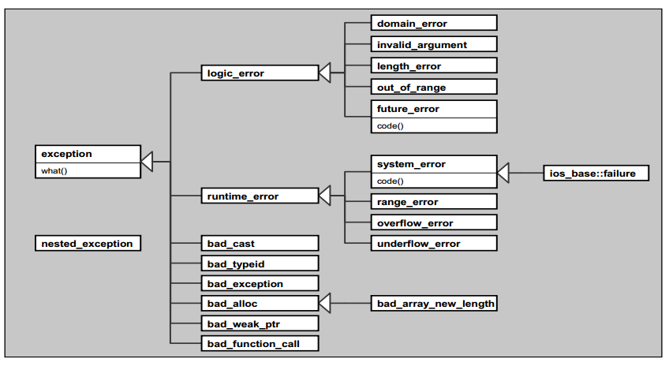

##  Chapter 5  通用工具

### `pair` 和 `tuple`

#### `pair`

为了能让程序能够处理`pair`的两个值,它提供了`直接访问对应的数据成员`的能力. `struct`实现.

```c++
namespace std{
    template<typename T1,typename T2>
    struct pair{
    T1 first;
    T2 second;
    ...
    }
}
```

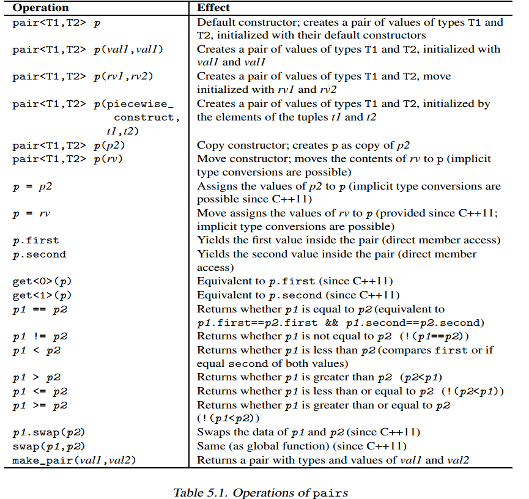

写一个泛型函数模板,用一个`value pair` 写入一个`stream`内.

```c++
template<typename T1,typename T2>
std::ostream& operator <<(std::ostream& strm,const std::pair<T1,T2>& p)
{
    return strm<<"["<<p.first<<","<<p.second<<"]";
}
```

自c++11起,可以使用`tuple_size<>::value`获取元素个数;`tuple_element<>::type`获取类型;`get()`获得`first`或者`second`.

```c++
typedef std::pair<int,float> IntFloatPair;
IntFloatPair p(42,3.14);
std::get<0>(p)                            //42
std::get<1>(p)                            //3.14
std::tuple_size<IntFloatPair>::value      //2
std::tuple_element<0,IntFloatPair>::type  //生成int
```

##### 构造函数和赋值

##### piecewise Construction(逐块式构造)

`Class pair<>`提供了3个构造函数,用以初始化`first`和`second`成员.

```c++
namespace std{
    template<typename T1, typename T2>
    struct pair{
    ...
    //1. 普通构造函数
    pair(const T1& x,const T2& y);
    //2. 涵盖对move semantic和隐式类型转换的支持
    template<typename U,typename V>
    pair(U&& x,V&& y);
    //3. 允许传递两个tuple(那是一种拥有不定个数元素且类型不同)
    template<typename... Args1,typename... Args2>
    	pair(piecewise_construct_t,
    	tuple<Args1...>first_args,
    	tuple<Args2...> second_args);
    	...
    };
}
```

备注:如果传递1或2个tuple,最前面两个构造函数允许初始化一个`pair`,但是其`first`和`second`是`tuple`类型;但是第三个构造函数使用`tuple`,将其元素传递给`first`和`second`的构造函数.为了强制这种行为,你**必须**传递`std::piecewise_construct_t`作为**额外**的**第一实参**. 举例:

```c++
#include <iostream>
#include <utility>
#include <tuple>
using namespace std;

class Foo{
  public:
    Foo(tuple<int,float>){
        cout<<"Foo::Foo(tuple)"<<endl;
    }  
    template<typename... Args>
    Foo(Args... args){
        cout << "Foo::Foo(args...)" << endl;
    }
};

int main(){
    tuple<int,float> t(1,2.22);// create tuple t:
    pair<int,Foo> p1(42,t);// pass the tuple as a whole to the constructor of Foo:
    // pass the elements of the tuple to the constructor of Foo:
    pair<int,Foo> p2(piecewise_construct,make_tuple(42),t);
}
//输出:
	//Foo::Foo(tuple)
	//Foo::Foo(args...)
```

只有当`piecewise_construct`被当做第一实参时,class Foo才会被迫使使用那个" **接受tuple的元素**(一个int一个float)而非**tuple整体** "的构造函数.

如你所见,两个实参必须是tuple才会迫使导致这个行为.因此第一实参42被显式转换为一个tuple,用的是`make_tuple`.

##### 便捷函数`make_pair()`

`make_pair()`可以让你无需写出类型就能生成一个pair对象

```c++
std::pair<int,char>(42,'@');
//可以这样
std::make_pair(42,'@');
```

* C++11 之前:

  ```c++
  namespace std{
      template<typename T1, typename T2>
      pair<T1,T2> make_pair(const T1& x,const T2& y){
      return pair<T1,T2>(x,y);
      }
  }
  ```

* C++11:考虑move semantic.

  ```C++
  namespace std{
      template<typename T1, typename T2>
      pair<V1,V2> make_pair(T1&& x,T2&& y);
      //返回类型取决于x,y的类型
  ```

##### Pair 之间的比较

```c++
namespace std{
    template<typename T1,typename T2>
    bool operator== (const pair<T1,T2>& x,const pair<T1,T2>& y){
    	return x.first==y.first)&&(x.second==y.second;
    }
    bool operator< (const pair<T1,T2>& x,const pair<T1,T2>& y){
    	return x.first<y.first||(!(x.first>y.first)&&x.second<y.second);
    }
}
```

#### Tuple

```c++
namespace std{
    //c++11引入variadic template,使得template接受任何数量的实参
    template <typename... Types>
    class tuple;
}
```

##### Tuple的操作

```C++
#include <tuple>
#include <iostream>
#include <complex>
#include <string>
using namespace std;

int main()
{
    // create a four-element tuple
    // - elements are initialized with default value (0 for fundamental types)
    tuple<string,int,int,complex<double>> t;
    // create and initialize a tuple explicitly
    tuple<int,float,string> t1(41,6.3,"nico");
    // ‘‘iterate’’ over elements:
    cout << get<0>(t1) << " ";
    cout << get<1>(t1) << " ";
    cout << get<2>(t1) << " ";
    cout << endl;
    // create tuple with make_tuple()
    // - auto declares t2 with type of right-hand side
    // - thus, type of t2 is tuple
    auto t2 = make_tuple(22,44,"nico");
    // assign second value in t2 to t1
    get<1>(t1) = get<1>(t2);
    // comparison and assignment
    // - including type conversion from tuple<int,int,const char*>
    // to tuple<int,float,string>
    if (t1 < t2) { // compares value for value
    t1 = t2; // OK, assigns value for value
    }
}
```

运用reference搭配make_tuple(),就可以提取tuple的元素值,将某些变量值设给他们.

```c++
std::tuple<int,float,std::string> t(77,2.2,"more");
int i;
float f;
std::string s;
//将t的值分别赋值给i,f,s
std::make_tuple(std::ref(i),std::ref(f),std::ref(s))=t;
//或者这样
std::tie(i,f,s)=t;//std::tie(i,f,s)会以i,s,f的引用建立起一个tuple.
```

##### Tuple 和初值列

**各个构造函数中,"接受不定个数的实参"的版本被声明为`explict`**

C++ explicit关键字的作用主要是用来修饰类的构造函数，表明该构造函数是显式的，禁止单参数构造函数的隐式转换。

``` c++
namespace std{
    template<typename... Types>
    class tuple{
    public:
    	explict tuple(const Types&...);
    	template<typename... UTypes> explict tuple(UTypes&&...);
    	...
    };
}
//这是为了避免单一值被隐式转换为"带者一个元素"的tuple:
template<typename... Args>
void foo(const std::tuple<Args...> t);
foo(42);       //ERROR
foo(make_tuple(42));//OK

//使用初值列定义tuple内容
std::tuple<int,double> t1(2,2.22);//OK
std::tuple<int,double> t2{2,2.22};//OK
//不可以使用赋值语句将某个tuple初始化
std::pair<int,double> t3={3,4.5};  //OK
std::tuple<int,double> t3={2,2.22};//ERROR
//你不可以将初值列传至"期望获得一个tuple"的地方
std::vector<std::tuple<int,float>> v {{1,2.3},{2,3.3}};//ERROR
std::tuple<int,int,int> foo(){
    return {1,1,1};//ERROR
}
//正确的做法,你必须明确的将初值转化为一个tuple类型
std::vector<std::tuple<int,float>> v {std::make_tuple(1,2.3),std::make_tuple(2,3.3)};//OK
std::tuple<int,int,int> foo(){
    return std::make_tuple(1,1,1);//ERROR
}

//注意:以上对于pair<>和容器(除了array<>)是行得通的
std::vector<std::pair<int,int>> v {{1,1},{2,2},{3,3}};//OK
std::vector<std::vector<float>> v {{1.0,2.0},{3.0,4.0}};//OK
std::vector<int> foo(){
    return {1,2,3};//OK
}
```


##### 其他特性

* `tuple_size<tupletype>::value`  获取元素个数
* `tuple_element<idx,tupletype>::type` 可获得第idx个元素的类型


* `tuple_cat()` 可将多个tuple串接成一个tuple.

  ```c++
  typename std::tuple<int,float,std::string> TupleType;
  std::tuple_size<TupleType>::value  //3
  std::tuple_element<1,TupleType>::type //float
  int n;
  auto tt=std::tuple_cat(std::make_tuple(42,7.7,"hello"),std::tie(n));
  //这里的tt成为一个tuple,拥有众多tuple的所有的元素,即便最后的元素是个reference to n.
  ```

### Smart Pointer

* `Class shared_ptr`:共享式拥有


* `Class unique_ptr`:独占式拥有

#### Class shared_ptr

​	当我们需要"当对象不再使用时就该被清理"的语义.也就是说,多个`shared_ptr`可以共享(或者说拥有)同一对象.对象的最末一个拥有者有责任销毁对象,并清理与该对象相关的资源.

​	如果对象以`new`产生,默认情况下清理情况由`delete`完成.但是,有时候你必须自己定义清理方案.举个例子,如果你的对象是个以`new[]`分配的`array`,你必须定义你的`delete[]`.

​	总而言之,`shared_ptr`目标就是,在其所指向的对象不再被需要之后,自动释放与其相关的资源.

##### 使用`shared_ptr`

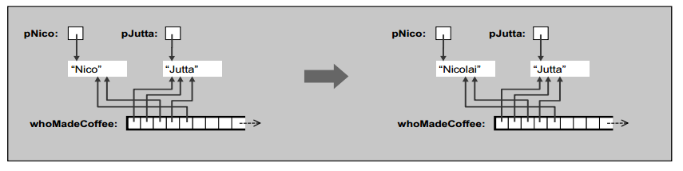

```c++
#include <iostream>
#include <string>
#include <vector>
#include <memory>
using namespace std;

int main(){
    shared_ptr<string> pNico(new string("nico"));
    shared_ptr<string> pJutta(new string("jutta"));
    (*pJutta)[0]='N';//取得pJutta所指的对象,重新赋值
    pJutta->replace(0,1,"J");//replace()替换第一位字母
    
    // put them multiple times in a container
    /*存放的是被复制的智能指针,而不是对象.所以不用拷贝对象;
    * 于是容器里含有多个"指向同一对象"的引用.这意味着,如果我们
    * 改动对象,该对象在容器中的所有身影都会被改动.
    */
    vector<shared_ptr<string>> whoMadeCoffee;
	whoMadeCoffee.push_back(pJutta);
    whoMadeCoffee.push_back(pJutta);
    whoMadeCoffee.push_back(pNico);
    whoMadeCoffee.push_back(pJutta);
    whoMadeCoffee.push_back(pNico);
    // print all elements
    for (auto ptr : whoMadeCoffee) {
    cout << *ptr << " ";  // Jutta Jutta Nico Jutta Nico 
    }
    cout << endl;
    // overwrite a name again
    *pNico = "Nicolai";
    // print all elements again
    for (auto ptr : whoMadeCoffee) {
    cout << *ptr << " "; //  Jutta Jutta Nicolai Jutta Nicolai
    }
    cout << endl;
    // 输出"针对vector内的第一个shared pointer"调用use_count()的结果
    // use_count()产出某个shared pointer所指对象的当前拥有者数量
    // 第一个是 pJutta;其余三个在容器里.
    cout << "use_count: " << whoMadeCoffee[0].use_count() << endl;//4
}
```

**注意**:由于"接受单一的pointer作为唯一实参"的构造函数是`explicit`,所以无法隐式转换,也就是你不能使用赋值符.但是,新的初始化语句是可以接受的.

```c++
//"接受单一的pointer作为唯一实参"的构造函数是explicit
template<typename _Tp1>
	explicit shared_ptr(_Tp1* __p)
        : __shared_ptr<_Tp>(__p) { }
```

```c++
shared_ptr<string> pNico = new string("nico"); // ERROR
shared_ptr<string> pNico{new string("nico")}; // OK

//也可以使用make_shared();这种建立方式比较安全,比较快,因为使用的是一次分配而不是二次分配
shared_ptr<string> pNico = make_shared<string>("nico");
shared_ptr<string> pJutta = make_shared<string>("jutta");

//另一种写法,可以声明shared pointer,然后赋值为一个新的pointer.但是不可以使用assignment操作符,必须用reset():
shared_ptr<string> pNico4;
pNico4=new string("nico");//ERROR:不可以用assignment
pNico4.reset(new string ("nico"));//OK
```

##### 定义一个`Deleter`

```c++
/**
       *  @brief  Construct a %shared_ptr that owns the pointer @a __p
       *          and the deleter @a __d.
       *  @param  __p  A pointer.
       *  @param  __d  A deleter.
       *  @post   use_count() == 1 && get() == __p
       *  @throw  std::bad_alloc, in which case @a __d(__p) is called.
       *
       *  Requirements: _Deleter's copy constructor and destructor must
       *  not throw
       *
       *  __shared_ptr will release __p by calling __d(__p)
*/
template<typename _Tp1, typename _Deleter>
	shared_ptr(_Tp1* __p, _Deleter __d)
        : __shared_ptr<_Tp>(__p, __d) { }
```

用下面这句代替`shared_ptr<string> pNico(new string("nico"));`

```c++
shared_ptr<string> pNico(new string("nico"),[](string* p){
    cout<<"delete"<<*p<<endl;
    delete p;} );
pNico=nullptr;//pNico设为nullptr,那么就引用数-1,容器里是pNico的拷贝(指针)
whoMadeCoffee.resize(2);//或者第二种:将容器设为2,只有Jutta Jutta 那么直接调用lambda函数.
```

这里传递了一个lambda作为`shared_ptr`构造函数的第二个实参.如果令pNico以这种方式声明,当其最末的一个拥有者被销毁时,会调用这个lambda函数.

##### 对付Array

##### 其他析构策略

如果其清理工作不仅是清理内存,你必须明确给出自己的`deleter`.你可以指定属于自己的析构策略.

假设我们想确保"指向某临时文件"的最末一个reference被销毁时,该文件即被移除.

```c++
#include <string>
#include <fstream> // for ofstream
#include <memory> // for shared_ptr
#include <cstdio> // for remove()
using namespace std;
class FileDeleter{
    private:
    	string filename;
    public:
    FileDeleter(const string& fn):filename(fn){
    }
    void operator() (ofstream* fp){
        fp->close;//close file
        std::remove(filename.c_str());//delete file
    }
};

int main(){
    shared_ptr<ofstream> fp(new ofstream("tmfile.txt"),FileDeleter("tmfile.txt"));
}
```

## Chapter 6 STL

STL组件中最关键的是容器/迭代器/算法.

### 容器

* 序列式容器 :有序集合 array, vector, deque, list, and forward_list
* 关联容器: set, multiset, map, and multimap.
* 无序容器: unordered_set, unordered_multiset, unordered_map, and unordered_multimap.

#### 序列容器

* `array<int,5>与array<int,10>`不是一个类型.元素个数也是array类型的一部分.

* `List`双向链表,不提供随机访问,一般性访问需要线性时间;比`vector`和`deque`常量时间要慢很多.

* `Forward List`单向链表,不支持后退移动,所以没有`push_back()`和`size()`.

####  关联容器

* 你不能直接改动元素的`value`,因为会破坏元素的自动排序.

* `map`或`multimap`处理元素时,每个元素的实际类型是`pair<const key,value>`.

  ```c++
  #include <map>
  #include <set>
  //c++11 可以一般初始化
  multimap<int,string> coll; // container for int/string values
  // insert some elements in arbitrary order
  // - a value with key 1 gets inserted twice
  coll = { {5,"tagged"},
  {2,"a"},
  {1,"this"},
  {4,"of"},
  {6,"strings"},
  {1,"is"},
  {3,"multimap"} };
  //set初始化
  multiset<string> cities {
  "Braunschweig", "Hanover", "Frankfurt", "New York",
  "Chicago", "Toronto", "Paris", "Frankfurt"
  };
  //注意他的insert()
  cities.insert({"London","Munich","Hanover", "Braunschweig"});
  ```

#### 容器适配器

* Stack
* Queue
* Priority queue

### 迭代器

自C++11起,我们可以使用`range-based for`循环来处理所有的元素,然而如果只是要找出某元素,并不是处理所有元素,我们需要迭代所有的元素,直到找到目标,或者将这个位置存放在某处,以便稍后迭代.因此我们需要这样一个概念:以一个对象表现出容器元素的位置.

* `range-based for`循环其实就是这个概念的一个便捷接口,其内部使用迭代器对象迭代所有的元素.
* 迭代器是一个"可以遍历STL容器全部或者部分元素"的对象.迭代器用来表示容器中的某一位置.
* 每一种容器都必须提供自己的迭代器,他是一种智能指针,其内部运行机制取决于遍历的数据结构.
  * `Operator *`返回当前位置的元素值;可以用操作符`->`取用他们
  * `Operator ++`令迭代器前进到下一个元素,大部分迭代器还有`Operator --`
  * `Operator ==`和`!=`判断两个迭代器是否指向同一位置
  * `Operator =`对迭代器赋值.

```c++
list<char> coll; 
for (char c=’a’; c<=’z’; ++c) {
	coll.push_back(c);
}
list<char>::const_iterator pos;
for(pos=coll.begin();pos!=coll.end();++pos){
    cout<<*pos<<" ";
}
```

* pos是"指向容器内常量元素"的迭代器`list<char>::const_iterator pos`
* 任何容器都定义有两种:
  * `container::iterator`:"读/写模式"
  * `container::const_iterator`:"只读模式"
* `++pos`比`pos++`效率高,后者需要一个临时对象,因为它必须存放迭代器的原本位置返回之

现在,我们可以用关键字`auto`代替迭代器的精确类型.(`list<char>::const_iterator pos;`)

```c++
for (auto pos = coll.begin(); pos != coll.end(); ++pos) {
cout << *pos << ’ ’;
}//但是,pos默认是非常量迭代器,要是返回类型是常量迭代器,可以
//cbegin() cend()
for (auto pos = coll.cbegin(); pos != coll.cend(); ++pos) {
...
}
```

#### `Range-Based for Loops` vs. `Iterators`

```c++
for (type elem : coll) {
...
}
//等价于
for (auto pos=coll.begin(), end=coll.end(); pos!=end; ++pos) {
type elem = *pos;
...
}
```

#### 关联式及无序图实例

* 之前的C++在对`set`进行插入的时候,是依次插入一个值;现在可以`coll.insert({1,2,3,4});`
* `set`自动默认从小到大排序,你也可以>为依据.`typedef set<int,greater<int>> IntSet;`
* `set`不允许序列容器才有的`push_back`或`push_front`,不允许你指定位置插入.

#### 迭代器的种类

+ **Forward iterators** : unordered_set, unordered_multiset, unordered_map, and unordered_multimap are “at least” forward iterators
+ **Bidirectional iterators**: 可以递增也可以递减 list, set, multiset, map, and multimap 
+ **Random-access iterators**: 除了双向外,还可以>/<操作符.vector, deque, array
+ **Input iterators** 
+ **Output iterators**

为了尽可能写出与容器无关的泛型代码,最好不要使用随机访问迭代器特有的操作

```c++
for (auto pos = coll.begin(); pos != coll.end(); ++pos) {
...
}
//下面代码无法在list set map上运行
for (auto pos = coll.begin(); pos < coll.end(); ++pos) {
...
}
```

### 算法

**算法并非容器的成员函数,而是一种搭配迭代器使用的全局函数.**

```c++
#include <algorithm>
#include <vector>
#include <iostream>
using namespace std;
int main(){
    vector<int> coll ={2,5,4,1,6,3};
    auto minpos=min_element(coll.cbegin(),coll.cend());
    auto maxpos = max_element(coll.cbegin(),coll.cend());
    sort(coll.begin(), coll.end());
    auto pos3 = find (coll.begin(), coll.end(),3);
    reverse (pos3, coll.end());
}
```

* `min_element()和 max_element`:返回最大/小的位置.**如果不止一个,返回第一个位置.**
* `sort()`:这里不使用`cbegin`因为会改变元素的值.**确实!**
* `reverse`:也是不使用`cbegin`.

#### 区间

所有的算法处理的都是半开区间:`[begin,end)`.

##### 处理多重区间

通常你必须设定第一区间的起点和终点,至于其他区间,只需设定起点即可.终点通常可以由第一区间的数量推导出来.

```c++
//逐一比较coll1与coll2的所有元素.
if(equal(coll1.begin(),coll1.end(),coll2.begin())){
    ...
}
```

如果算法来处理多重区间,那么当你调用它时,务必确保第二区间所拥有的元素数量个数至少和第一区间一样多.

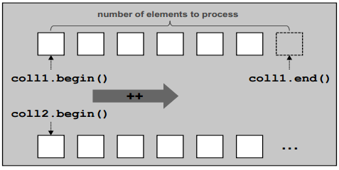

```c++
#include <algorithm>
#include <list>
#include <vector>
using namespace std;
int main()
{
    list<int> coll1 = { 1, 2, 3, 4, 5, 6, 7, 8, 9 };
    vector<int> coll2;
    // RUNTIME ERROR:
    // - overwrites nonexisting elements in the destination
    copy (coll1.cbegin(), coll1.cend(), // source  
    coll2.begin()); // destination
    ...
}
```

这里的`copy()`算法,将第一区间的全部元素拷贝到第二区间.由于算法执行的是覆写(overwrite)而非插入(insert)动作.

**Notes**: 

* 源目标迭代器用的`常量迭代器`,第二区间用的是`非常量迭代器`
* 添加`resize()`修改第二区间长度.

### 迭代器适配器

C++标准库提供了数个预定义的特殊迭代器,也称_**迭代器适配器**_

1. **Insert iterators**: 安插型迭代器
2. **Stream iterators**: 串流型迭代器
3. **Reverse iterators**:逆向迭代器
4. **Move iterators (since C++11)**:搬移迭代器

#### **Insert iterators**: 安插型迭代器

他可以解决算法以安插(insert)方式而非覆写(overwrite)方式运作.使用他可以解决"目标空间不足"问题.

```c++
#include <algorithm>
#include <iterator>
#include <list>
#include <vector>
#include <deque>
#include <set>
#include <iostream>
using namespace std;

int main()
{
list<int> coll1 = { 1, 2, 3, 4, 5, 6, 7, 8, 9 };
// copy the elements of coll1 into coll2 by appending them
vector<int> coll2;
copy (coll1.cbegin(), coll1.cend(), // source
back_inserter(coll2)); // destination
// copy the elements of coll1 into coll3 by inserting them at the front
// - reverses the order of the elements
deque<int> coll3;
copy (coll1.cbegin(), coll1.cend(), // source
front_inserter(coll3)); // destination
// copy elements of coll1 into coll4
// - only inserter that works for associative collections
set<int> coll4;
copy (coll1.cbegin(), coll1.cend(), // source
inserter(coll4,coll4.begin())); // destination
}
```

此例运用了三种预定义的`inser iterator`:

1. **Back inserters **(安插在容器的最末端) 其内部调用`push_back()`,相当于"追加"动作.

   ```c++
   copy (coll1.cbegin(), coll1.cend(), // source
   back_inserter(coll2)); // destination
   ```

   当然只有容器能提供`push_back()`才可以用.例如`vector/deque/list/string`

2. **Front inserters**(安插于容器最前端):其内部调用`push_front()`.只有`deque/list/forward_list`.

   * 注意反转了被插入元素的次序.

3. **General inserters**(普通插入),需要指明插入的位置,在所指位置前方插入元素.内部调用`insert()`,并以新值与新位置作为实参传入.

   ```c++
   copy (coll1.cbegin(), coll1.cend(), // source
   inserter(coll4,coll4.begin())); // destination
   ```

   * 这是唯一可用于关联容器身上的预定义的`insert`.(**虽然关联容器插入时不能指定位置,但他们可以忽略**)
   * 不改变顺序.

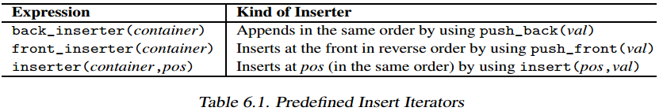

#### Stream Iterators(串流迭代器)

```c++
#include <iterator>
#include <algorithm>
#include <vector>
#include <string>
#include <iostream>
using namespace std;

int main()
{
    vector<string> coll;
    // read all words from the standard input
    // - source: all strings until end-of-file (or error)
    // - destination: coll (inserting)
    copy (istream_iterator<string>(cin), // start of source
    istream_iterator<string>(), // end of source
    back_inserter(coll)); // destination
    // sort elements
    sort (coll.begin(), coll.end());
    // print all elements without duplicates
    // - source: coll
    // - destination: standard output (with newline between elements)
    unique_copy (coll.cbegin(), coll.cend(), // source
    ostream_iterator<string>(cout,"\n")); // destination
}
```

#### Reverse Iterators

Reverse Iterators 会造成算法的逆向操作,其内部将对`++`实行`--`.	

所有提供双向或者随机访问迭代器的容器(除了forward_list之外所有的序列容器和所有关联式容器) 都可以通过他们的成员函数`rbegin()`和`rend()`产生一个反向迭代器.自C++起还提供了一组对于的成员函数`crbegin()`和`crend()`,他们会返回只读反向迭代器.

```c++
#include <iterator>
#include <algorithm>
#include <vector>
#include <iostream>
using namespace std;
int main()
{
    vector<int> coll;
    // insert elements from 1 to 9
    for (int i=1; i<=9; ++i) {
    	coll.push_back(i);
	}
    copy(coll.crbegin(),coll.crend(),ostream_iterator<int>(cout," "));
    cout<<endl;
}
```

`coll.crend()`:所指向容器内第一元素的前一位置.不要`*coll.crend`,无效元素!

#### Move Iterators

他们允许从一个容器移动元素到另一个容器.(后面再讲)

### 用户自定义的泛型函数

### Manipulating Algorithms(更易型算法)

是指会"移除或重排或修改"元素的算法.

#### 移除(Removing) 元素

```c++
#include <algorithm>
#include <iterator>
#include <list>
#include <iostream>
using namespace std;
int main()
{
    list<int> coll;
    // insert elements from 6 to 1 and 1 to 6
    for (int i=1; i<=6; ++i) {
        coll.push_front(i);
        coll.push_back(i);
    }
    // print all elements of the collection
    cout << "pre: ";
    copy (coll.cbegin(), coll.cend(), // source
    ostream_iterator<int>(cout," ")); // destination
    cout << endl;
    // remove all elements with value 3
    remove (coll.begin(), coll.end(), // range
    3); // value
    // print all elements of the collection
    cout << "post: ";
    copy (coll.cbegin(), coll.cend(), // source
    ostream_iterator<int>(cout," ")); // destination
    cout << endl;
}
//pre: 6 5 4 3 2 1 1 2 3 4 5 6
//post: 6 5 4 2 1 1 2 4 5 6 5 6
```

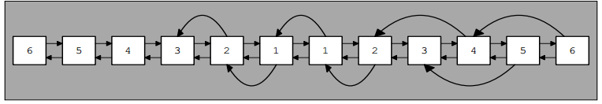

`remove()`并没有改变集合中的元素数量.`cend()`返回的还是当初那个终点,`size()`返回的还是当初那个大小.

改进后的版本:

```c++
#include <algorithm>
#include <iterator>
#include <list>
#include <iostream>
using namespace std;
int main()
{
    list<int> coll;
    // insert elements from 6 to 1 and 1 to 6
    for (int i=1; i<=6; ++i) {
        coll.push_front(i);
        coll.push_back(i);
    }
    // print all elements of the collection
    copy (coll.cbegin(), coll.cend(),
    ostream_iterator<int>(cout," "));
    cout << endl;
    list<int>::iterator end = remove (coll.begin(), coll.end(),
    3);
    // print resulting elements of the collection
    copy (coll.begin(), end,
    ostream_iterator<int>(cout," "));
    cout << endl;
    // print number of removed elements
    cout << "number of removed elements: "
    << distance(end,coll.end()) << endl;
    // remove ‘‘removed’’ elements
    coll.erase (end, coll.end());
    // print all elements of the modified collection
    copy (coll.cbegin(), coll.cend(),
    ostream_iterator<int>(cout," "));
    cout << endl;
}
```

在这个版本里,`list<int>::iterator end = remove (coll.begin(), coll.end(),3);`,这个`end`是被修改集合后,经过元素移动后新的逻辑终点.

如果想要真正的删除元素,可以调用成员函数`erase()`:`coll.erase(end,coll.end);`

正常的用法如下:

```c++
coll.erase(remove(coll.begin(),coll.end(),3),coll.end());//注意:不可以用coll.cbegin()!!!
```

总结一下:为什么算法不自己调用`erase()`呢?这个问题正好点出STL为获得弹性而付出的代价.通过"以迭代器为接口",STL将数据结构与算法分离开来.

#### 如何更易关联和无序容器呢?

如果更易型算法用在关联或无序容器里,会破坏位置.进而破坏容器本身对次序的维护(关联容器是其已排好序;对无序容器而言则是其hash函数的运算结果.)

很简单!调用他们自己的成员函数.

#### 算法vs.成员函数

容器本身可能提供功能相似而效能更佳的成员函数.比如`list`的元素调用`remove()`.

算法本身并不知道他工作于`list`身上,因此他在任何容器中都一样:改变元素值,重新排列元素.如果他移除了第一个元素,后面所有的元素就会分别被设给各自的前一个元素.这就违反了`list`的主要优点---修改`link`而非实值来安插/移动/移除元素.

**你应该总是优先选用成员函数.**

`list`的成员函数`remove`:真正的移除.但是换了容器,就不行了.

```c++
#include <list>
#include <algorithm>
using namespace std;
int main()
{
    list<int> coll;
    // insert elements from 6 to 1 and 1 to 6
    for (int i=1; i<=6; ++i) {
    coll.push_front(i);
    coll.push_back(i);
    }
    // remove all elements with value 3 (poor performance)
    coll.erase (remove(coll.begin(),coll.end(),
    3),
    coll.end());
    // remove all elements with value 4 (good performance)
    coll.remove (4);
}
```

### 以函数作为算法的实参

* for_each()
* transform()
* find_if: 单判断式

Example1: `for_each()`

```c++
#include <vector>
#include <algorithm>
#include <iostream>
using namespace std;
// function that prints the passed argument
void print (int elem)
{
	cout << elem << ’ ’;
}
int main()
{
    vector<int> coll;
    // insert elements from 1 to 9
    for (int i=1; i<=9; ++i) {
    	coll.push_back(i);
    }
    // print all elements
    for_each (coll.cbegin(), coll.cend(), // range
    print); // operation
    cout << endl;
}
```

Example2 :`transform()`

```c++
#include <set>
#include <vector>
#include <algorithm>
#include <iterator>
#include <iostream>
#include "print.hpp"
int square (int value)
{
	return value*value;
}
int main()
{
    std::set<int> coll1;
    std::vector<int> coll2;
    // insert elements from 1 to 9 into coll1
    for (int i=1; i<=9; ++i) {
    	coll1.insert(i);
    }
    PRINT_ELEMENTS(coll1,"initialized: ");
    // transform each element from coll1 to coll2
    // - square transformed values
    std::transform (coll1.cbegin(),coll1.cend(), // source
    std::back_inserter(coll2), // destination
    square); // operation
    PRINT_ELEMENTS(coll2,"squared: ");
}
```

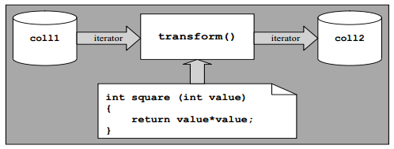

Example 3:

```c++
#include <list>
#include <algorithm>
#include <iostream>
#include <cstdlib> // for abs()
using namespace std;
// predicate, which returns whether an integer is a prime number
bool isPrime (int number)
{
    // ignore negative sign
    number = abs(number);
    // 0 and 1 are no prime numbers
    if (number == 0 || number == 1) {
        return false;
}
// find divisor that divides without a remainder
int divisor;
for (divisor = number/2; number%divisor != 0; --divisor) {
    ;
}
    // if no divisor greater than 1 is found, it is a prime number
    return divisor == 1;
}
int main()
{
    list<int> coll;
    // insert elements from 24 to 30
    for (int i=24; i<=30; ++i) {
    coll.push_back(i);
    }
    // search for prime number
    auto pos = find_if (coll.cbegin(), coll.cend(), // range
    isPrime); // predicate
    if (pos != coll.end()) {
    // found
    cout << *pos << " is first prime number found" << endl;
    }
    else {
    // not found
    cout << "no prime number found" << endl;
    }
}
```
Example4 
```c++
// stl/sort1.cpp
#include <algorithm>
#include <deque>
#include <string>
#include <iostream>
using namespace std;
class Person {
public:
    string firstname() const;
    string lastname() const;
    ...
};
// binary function predicate:
// - returns whether a person is less than another person
bool personSortCriterion (const Person& p1, const Person& p2)
{
// a person is less than another person
// - if the last name is less
// - if the last name is equal and the first name is less
    return p1.lastname()<p2.lastname() ||
    (p1.lastname()==p2.lastname() &&
    p1.firstname()<p2.firstname());
}
int main()
{
    deque<Person> coll;
    ...
    sort(coll.begin(),coll.end(), // range
    personSortCriterion); // sort criterion
    ...
}

```

### 使用Lambda

可以说是对以函数作为算法参数的一种改进方式.

```c++
std::transform(coll.begin(),coll.end(),coll.begin(),[](double d){return d*d*d});
```

#### 使用lambda的好处

```c++
// stl/lambda1.cpp
#include <algorithm>
#include <deque>
#include <iostream>
using namespace std;
int main()
{
	deque<int> coll = { 1, 3, 19, 5, 13, 7, 11, 2, 17 };
    int x = 5;
    int y = 12;
    auto pos = find_if (coll.cbegin(), coll.cend(), // range
    [=](int i) { // search criterion
    return i > x && i < y;
    });
    cout << "first elem >5 and <12: " << *pos << endl;
}
```

#### 以lambda作为排序准则

```c++
#include <algorithm>
#include <deque>
#include <string>
#include <iostream>
using namespace std;

class Person {
public:
    string firstname() const;
    string lastname() const;
    ...
};
int main()
{
    deque<Person> coll;
    ...
    // sort Persons according to lastname (and firstname):
    sort(coll.begin(),coll.end(), // range
    [] (const Person& p1, const Person& p2) { // sort criterion
    return p1.lastname()<p2.lastname() ||
    (p1.lastname()==p2.lastname() &&
    p1.firstname()<p2.firstname());
    });
    ...
}
```

#### lambda的局限

lambda并非在每一方面都保持优势.让我们考虑使用lambda为关联容器只出一个排序准则:

```c++
auto cmp=[](const Person& p1,const Person& p2){
    return (p1.lastname()<p2.lastname()||p1.lastname()==p2.lastname() &&p1.firstname()<p2.firstname());
    ...
}
std::set<Person,decltype(cmp)> coll(cmp);
```

* 由于set声明式需要指明lambda类型,所以我们必须使用`decltype`,他会为一个lambda对象产生类型.
* 你必须把cmp传进coll的构造函数,否则coll为调用自己的默认构造函数.

### 函数对象(Function Object)

传递给算法的"函数型实参"不一定是函数,可以是类似函数行为的对象.这种对象叫函数对象,或称为仿函数(functor).(1)函数指针.(2)"带有成员函数operator()"的class所建立的对象.(3)"带有转换函数可将自己转换成pointer to function"的class所建立的对象.(4)lambda.

#### 定义一个函数对象

什么才叫具备函数行为?是指可以"使用小括号传递实参,借以调用某个东西".

```c++
class X{
    public:
    return-value operator() (arguments) const;
    ...
};

X foo;
foo(arg1,arg2);
//等同于
foo.operator()(arg1,arg2);
```

```c++
// stl/foreach2.cpp
#include <vector>
#include <algorithm>
#include <iostream>
using namespace std;

class PrintInt{
    void operator() (int elem) const{
        cout<<elem<<" ";
    }
};

int main(){
    vector<int> coll;
    for (int i=1; i<=9; ++i) {
		coll.push_back(i);
	}
    for_each(coll.begin(),coll.end(),PrintInt());
    cout<<endl;
}
```

来看一下`for_each()`算法:

```c++
namespace std{
    template<typename Iterator,typename Operatoin>
    Operation for_each(Iterator act,Iterator end, Operation op)
    {
        while(act!=end){
            op(*act);
            ++act;
        }
        return op;
    }
}
```
`for_each()`使用临时对象`op`(一个函数对象),针对每个元素`act`调用`op(*act)`.如果第三实参`op`是个`寻常函数`,就以`*act`为实参调用之;如果第三实参是函数对象,调用函数对象`op`的`operator()`.

* **函数对象比寻常函数速度快.** 就template概念而言,由于更多细节在编译期就已经确定,可以得到更好的优化.
* **函数对象是一种带状态的函数**. 可拥有成员函数和成员变量,则意味着函数对象拥有状态.
* **每个函数对象有自己的类型**.

对比:

#### 预定义的函数对象

C++标准库里内涵若干预定义的函数对象,涵盖了许多基础运算.典型的例子是作为排序准则的函数对象.`operator<`默认的排序准则是调用`<less>`.

```c++
set<int,less<int>> coll;
set<int,greater<int>> coll;
```

另一个运用预定义函数对象的是STL算法.

```c++
// stl/fo1.cpp
#include <deque>
#include <algorithm>
#include <functional>
#include <iostream>
#include "print.hpp"
using namespace std;
int main()
{
    deque<int> coll1 = { 1, 2, 3, 5, 7, 11, 13, 17, 19 };
    deque<int> coll2 = { 0, 2, 0, 5, 0, 11, 0, 17, 0};
    
    transform (coll1.cbegin(),coll1.cend(), // source
    coll1.begin(), // destination
    negate<int>()); // operation

    transform (coll1.cbegin(),coll1.cend(), // first source
    coll2.cbegin(), // second source
    coll2.begin(), // destination
    multiplies<int>()); // operation
}
```

`multiplies<int>()`:相乘,两个容器之间的元素依次相乘. 目标1区间;目标2区间;结果区间

#### Binder

你可以使用特殊的`function adaptor`(函数适配器),或所谓的`binder`,将预定义的函数对象和其他数值结合为一体.

```c++
// stl/bind1.cpp
#include <set>
#include <deque>
#include <algorithm>
#include <iterator>
#include <functional>
#include <iostream>
#include "print.hpp"
using namespace std;
using namespace std::placeholders;
int main()
{
    set<int,greater<int>> coll1 = { 1, 2, 3, 4, 5, 6, 7, 8, 9 };
    deque<int> coll2;
    // Note: due to the sorting criterion greater<>() elements have reverse order:
    PRINT_ELEMENTS(coll1,"initialized: ");
    // transform all elements into coll2 by multiplying them with 10
    transform (coll1.cbegin(),coll1.cend(), // source
    back_inserter(coll2), // destination
    bind(multiplies<int>(),_1,10)); // operation
    PRINT_ELEMENTS(coll2,"transformed: ");
    // replace value equal to 70 with 42
    replace_if (coll2.begin(),coll2.end(), // range
    bind(equal_to<int>(),_1,70), // replace criterion
    42); // new value
    PRINT_ELEMENTS(coll2,"replaced: ");
    // remove all elements with values between 50 and 80
    coll2.erase(remove_if(coll2.begin(),coll2.end(),
    bind(logical_and<bool>(),
    bind(greater_equal<int>(),_1,50),
    bind(less_equal<int>(),_1,80))),
    coll2.end());
    PRINT_ELEMENTS(coll2,"removed: ");
}
```

```c
// 将coll1里所有的元素都乘以10,然后以安插模式传送到coll2
transform (coll1.cbegin(),coll1.cend(), // source
    back_inserter(coll2), // destination
// 定义一个函数对象,会将传入的第一实参乘以10
// 他允许你借由 底层的函数对象 和 占位符 合成 高层的函数对象
    bind(multiplies<int>(),_1,10)); // operation
```

你还可以这样:

```c++
auto f=bind(multiplies<int>(),_1,10);
cout<<f(99)<<endl;//990
```

```c++
//从coll2里的元素 第一实参与70比较
//bind()调用equal_to<int>(),并把他所收到的第一参数作为后者的第一实参,以70作为第二实参
repalce_if(coll2.begin(),coll2.end(),bind(equal_to<int>(),_1,70),42);
```

## Chapter 7  STL容器

### 容器的共通能力和共通操作

* 所有容器提供的都是"value语义"而不是"reference语义".
* 元素在容器里尤其特定的顺序.
* 一般来说,各项操作并不安全,他们不会检查每一个可能发生的错误.

#### 初始化

```c++
const std::vector<int> v1={1,2,3,4,5,6,7,8,9};
const std::vector<int> v2 {1,2,3,4,5,6,7,8,9};
```

针对某个给定区间而写的构造函数,提供来自另一容器元素为初值的能力.这个构造函数是个`member template`.所以不只是容器,连元素类型都不同.

* 以另一个容器为初值,完成初始化动作.

  ```c++
  std::list<int> l;
  vector<float> c(l.begin(),l.end());
  ```

  或者C++11以后你还可以在这种情况下使用一个`move`迭代器来搬移元素:

  ```c++
  std::vector<std::string> c(std::make_move_iterator(l.begin()),std::make_move_iterator(l.end()));
  ```

* 以标准输入设备完成初始化动作:

  ```c++
  std::deque<int> c{ std::istream_iterator<int>(std::cin),std::istream_iterator<int>() };//推荐,不会产生歧义
  std::deque<int> c((std::istream_iterator<int>(std::cin)),(std::istream_iterator<int>()));//没有小括号,会报错!
  std::deque<int> c(std::istream_iterator<int>(std::cin),std::istream_iterator<int>());//默认为函数,返回类型:deque,
  //第一参数类型是std::istream_iterator<int>,参数名是cin
  //第二参数无名称,类型是一个函数,不接受实参,返回类型是std::istream_iterator<int>
  ```

#### 赋值和swap()

建议用move赋值语义.

```c++
std::vector<int> v1;
std::vector<int> v2;
...
// move contents of v1 into v2, state of v1 undefined afterward
v2 = std::move(v1);
```

#### 与大小相关的操作函数

1. empty():尽量用,常量时间复杂度
2. size()
3. max_size() 返回索引类型的最大值.

#### 比较

除了无序容器,常用的比较操作符`== != < > <= >=`,依据下面3个规则定义出来:

1. 比较两端(容器)必须是同一类型.
2. 如果容器的所有元素依序相等,那么这两个容器亮灯.
3. 采用**字典式比较**来判断某个容器是否小于另一个.

无序容器自定义`== !=`,但容器内每个元素在另一个容器内右相等的元素,这些操作就返回true.

#### 元素访问

* 所有的容器都支持迭代器接口,也就是支持:

  ```c++
  for (const auto& elem : coll) {
  	std::cout << elem << std::endl;
  }
  //To be able to manipulate the elements, you should skip the const:
  for (auto& elem : coll) {
  	elem = ...;
  }
  ```

* 如果想要获得位置其后可以操作(比如安插,删除,移动):

  ```c++
  for (auto pos=coll.cbegin(); pos!=coll.cend(); ++pos) {
  	std::cout << *pos << std::endl;
  }
  //and iterators yielded by begin() and end() for write access:
  for (auto pos=coll.begin(); pos!=coll.end(); ++pos) {
  	*pos = ...;
  }
  //c++11 之前,必须先声明迭代器
  colltype::const_iterator pos;
  for (pos=coll.begin(); pos!=coll.end(); ++pos) {
  	...;
  }
  ```

如果删除元素,所有容器(除了vector和deque)都保证迭代器以及引用继续保持有效.但对于vector,只有删除点之前的元素才保持有效.

如果安插元素,vector如果发生重新分配内存,那么迭代器以及引用无效.

### Array

观念上的array是指一系列元素,有着固定的大小.因此,你无法增加或移除元素而改变大小.他只允许你替换元素值.

Array不支持(也就是不允许你指定)分配器(allocator).

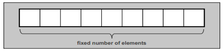

```c++
namespace std{
    template <typename T,size_t N>
    class array;
}
```

以下笼统的讲一下`Array`细节

```c++
//*1. array<>是唯一一个"无任何东西被指定为初值时,会被"预初始化"的容器",则意味着,初值可能不明确,而不是0
array<int,4> x;//OOPS:x没有定义的值
//你可以这样给他提供一个空白初值列,保证初始化,基础类型为0
array<int,4> x={};//OK 所有元素都为0
//*2. 如果初值列没有足够的元素,默认为0
std::array<int,10> c2 = { 42 }; // one element with value 42 followed by 9 elements with value 0
std::array<int,5> c3 = { 1, 2, 3, 4, 5, 6 }; // ERROR: too many values
std::array<int,5> a({ 1, 2, 3, 4, 5, 6 }); // ERROR
std::vector<int> v({ 1, 2, 3, 4, 5, 6 }); // OK
//*3. 大小
std::array<Elem,0> coll; // array with no elements
std::sort(coll.begin(),coll.end()); // OK (but has no effect)
coll[5] = elem; // RUNTIME ERROR ⇒ undefined behavior
std::cout << coll.front(); // RUNTIME ERROR ⇒ undefined behavior
```

元素访问:

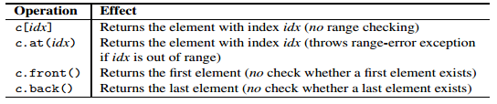

**只有`c.at(idx)`执行了范围检查!**

Examples of Using Arrays

```c++
The following example shows a simple use of class array<>:
// cont/array1.cpp
#include <array>
#include <algorithm>
#include <functional>
#include <numeric>
#include "print.hpp"
using namespace std;
int main()
{
    // create array with 10 ints
    array<int,10> a = { 11, 22, 33, 44 };
    PRINT_ELEMENTS(a);
    // modify last two elements
    a.back() = 9999999;
    a[a.size()-2] = 42;
    PRINT_ELEMENTS(a);
    // process sum of all elements
    cout << "sum: "<< accumulate(a.begin(),a.end(),0)<< endl;
    // negate all elements
    transform(a.begin(),a.end(), // source
    a.begin(), // destination
    negate<int>()); // operation
    PRINT_ELEMENTS(a);
}
//11 22 33 44 0 0 0 0 42 999999
//sum:10000151
```

### Vector

```c++
namespace std{
    template<typename T,typename Allocator= allocator<T>>
    class vector;
}
```

#### vector 的能力

* vector支持随机访问,常量时间访问.
* vector提供随机访问迭代器,所以使用任何STL算法.

##### 大小(Size)和容量(Capacity)

`capacity()`:返回vector实际能容纳的元素量.如果超出这个量,vector就有必要重新分配内存.

+ Reallocation invalidates all references, pointers, and iterators for elements of the vector.
+ Reallocation takes time.

你可以使用`reserve()`保留适量容量,避免内存分配.`v.reserve(80);`

或者,初始化期间就向构造函数传递额外实参,构建足够的空间:`std::vector<T> v(5);`但是,如果类型是个非常复杂的对象,初始化也非常耗时.还不如使用`reserve()`.

不过会很浪费内存.(具体看Effective STL $17).

C++11引入了一个vector新函数:一个**不具强制力**的要求,可以缩减容量以符合当前元素个数.`v.shrink_to_fit()`,这个要求不具强制力,以便为实现可能的特有优化保留回旋余地.因此你不可期望之后的`v.capacity==v.size() `为 true.

**在C++11之前,有一个实现缩减vector容量的小窍门:两个vector交换内容后,两者的容量也互换.**

```c++
template<typename T>
void shrinkCapacity(std::vector<T>& v){
    std::vector<T> temp(v);//copy v to tmp
    v.swap(tmp);
}
```

你甚至可以直接这样缩减容量:

```c
std::vector<T>(v).swap(v);
```

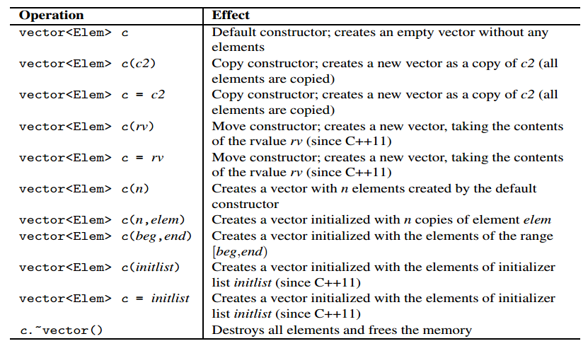

##### 元素访问

**元素访问对于调用者来说,最重要的是搞清楚这些操作是否执行范围检查.只有`at`那么做,如果越界,抛出`out_of_range`异常.其他函数不做检查,如果对一个空`vector`调用`operator [ ], front(), and back()`则会引发不明确的行为.**

所以:调用`operator []`心里必须有数,确保索引有效;调用`front() or back()`必须确保容器不为空.

##### 安插和移除

关于效能,以下情况你可与预期安插动作和移除动作会比较快:

+ 在容器尾部安插或移除元素.
+ 容量一开始就够大
+ 安插多个元素时,**调用一次**比**调用多次**来的快

安插或移除,都会使"作用点"之后的各元素的引用.指针.迭代器失效!

vector并没有直接函数可以移除"与某值相等"的所有元素.这就是算法发挥的时候了:

```c++
std::vector<Elem> coll;
coll.erase(remove(coll.begin(),coll.end(),val),coll.end());
//如果只是移除相等的第一个元素
std::vector<Elem>::iterator pos;
pos=find(coll.begin(),coll.end(),val);
if(pos!=coll.end())
    coll.erase(pos);
```

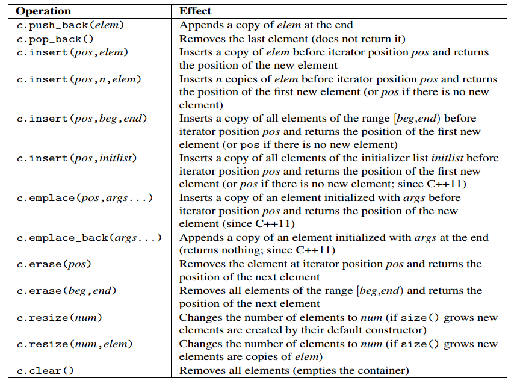

[关于`emplace`与`push`区别](https://github.com/HitLumino/studynotes/blob/master/C%2B%2B_one_month_project/C%2B%2BPrimer.md#1notes-%E5%AF%B9%E6%AF%94push%E5%92%8Cemplace%E6%88%90%E5%91%98%E5%87%BD%E6%95%B0)

##### Examples

```c++
// cont/vector1.cpp
#include <vector>
#include <iostream>
#include <string>
#include <algorithm>
#include <iterator>
using namespace std;
int main()
{
    // create empty vector for strings
    vector<string> sentence;
    // reserve memory for five elements to avoid reallocation
    sentence.reserve(5);
    // append some elements
    sentence.push_back("Hello,");
    sentence.insert(sentence.end(),{"how","are","you","?"});
    // print elements separated with spaces
    copy (sentence.cbegin(), sentence.cend(),
    ostream_iterator<string>(cout," "));
    cout << endl;
    // print ‘‘technical data’’
    cout << " max_size(): " << sentence.max_size() << endl;
    cout << " size(): " << sentence.size() << endl;
    cout << " capacity(): " << sentence.capacity() << endl;
    // swap second and fourth element
    swap (sentence[1], sentence[3]);
    // insert element "always" before element "?"
    sentence.insert (find(sentence.begin(),sentence.end(),"?"),
    "always");
    // assign "!" to the last element
    sentence.back() = "!";
    // print elements separated with spaces
    copy (sentence.cbegin(), sentence.cend(),
    ostream_iterator<string>(cout," "));
    cout << endl;
    // print some ‘‘technical data’’ again
    cout << " size(): " << sentence.size() << endl;
    cout << " capacity(): " << sentence.capacity() << endl;
    // delete last two elements
    sentence.pop_back();
    sentence.pop_back();
    // shrink capacity (since C++11)
    sentence.shrink_to_fit();
    // print some ‘‘technical data’’ again
    cout << " size(): " << sentence.size() << endl;
    cout << " capacity(): " << sentence.capacity() << endl;
}
```

##### `Class vector<bool>`

