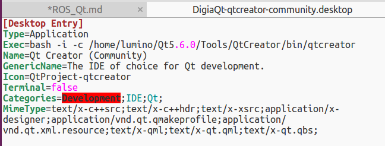
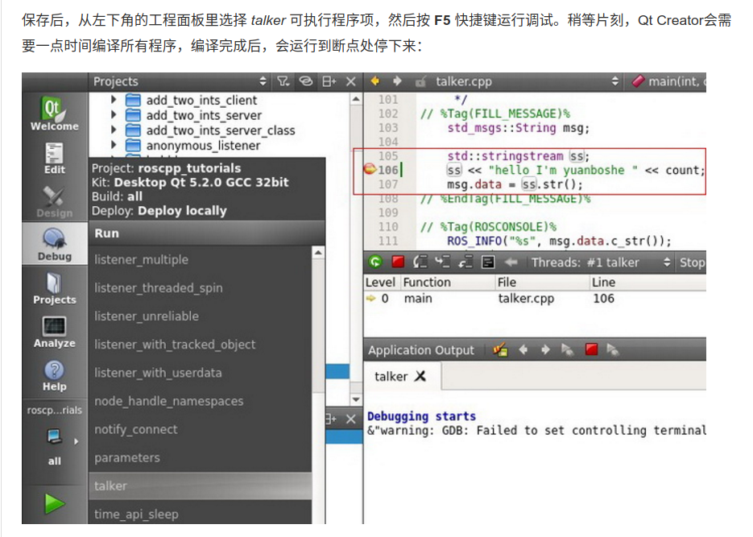

## ROS在Qt下的配置：
[http://blog.csdn.net/linuxarmsummary/article/details/48476171]

`gedit ~/.local/share/applications/DigiaQt-qtcreator-community.desktop`  
  
修改 Exec 变量一行，在中间添加 bash -i -c 即改为 Exec=bash -i -c  
**注意：**
bash -i -c 后要留一个空格，否则会导致Qt打不开。
## 若含有多个节点
在debug里选择当前节点，然后再运行。

