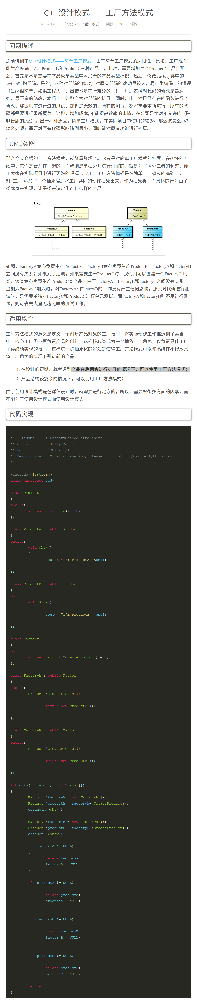
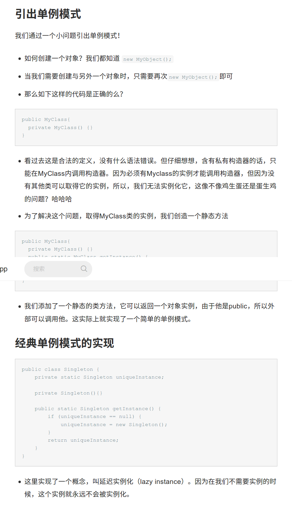

# 设计模式---factory function

# 单件模式---singleton pattern
单件模式(singleton pattern) : 确保一个类只有一个实例, 并提供一个全局访问点.  
单价模式包括3个部分: 私有构造器, 静态变量, 静态方法.
## 参考链接：  
* [系统架构技能之设计模式-单件模式](http://www.cnblogs.com/hegezhou_hot/archive/2010/10/02/1841390.html)
* [设计模式之单件模式（Singleton Pattern）](http://www.jianshu.com/p/fb7a09b4e34a)  


以下来自高博VO的config类：  
config.h
```
#define CONFIG_H

#include "myslam/common_include.h" 

namespace myslam 
{
class Config
{
private:
    static std::shared_ptr<Config> config_; //静态成员变量 config_
    cv::FileStorage file_;
    
    Config () {} // private constructor makes a singleton  私有构造函数
public:
    ~Config();  // close the file when deconstructing 
    
    // set a new config file 
    static void setParameterFile( const std::string& filename ); //静态方法
    
    // access the parameter values
    template< typename T >
    static T get( const std::string& key )
    {
        return T( Config::config_->file_[key] );
    }
};
}

#endif // CONFIG_H
```
------------------------------------
config.cpp
```
#include "myslam/config.h"

namespace myslam 
{
    
void Config::setParameterFile( const std::string& filename )//公有静态方法，静态变量是`config_`，只有这个*内部函数*能实例化`config()`
{
    if ( config_ == nullptr )
        config_ = shared_ptr<Config>(new Config);//内部调用私有构造函数`Config()`,返回对象“config_”的实例，这个实例也在内部定义好了，即静态成员变量  `private static std::shared_ptr<Config> config_;` 
    config_->file_ = cv::FileStorage( filename.c_str(), cv::FileStorage::READ );
    if ( config_->file_.isOpened() == false )
    {
        std::cerr<<"parameter file "<<filename<<" does not exist."<<std::endl;
        config_->file_.release();
        return;
    }
}

Config::~Config()
{
    if ( file_.isOpened() )
        file_.release();
}

shared_ptr<Config> Config::config_ = nullptr;

}
```
