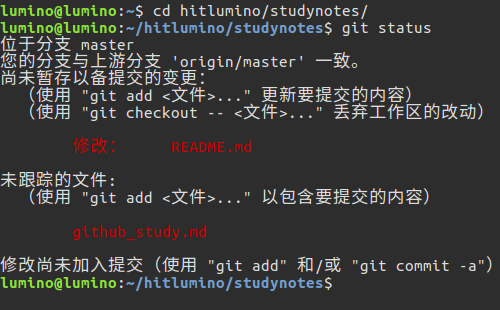
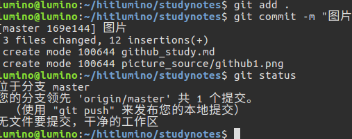

## 如何创建一个repository并同步
在所在目录里建文件夹  
echo "# studynotes" >> README.md  
git init  
git add README.md  
git commit -m "first commit"  
git remote add origin https://github.com/HitLumino/studynotes.git  
git push -u origin master//第一次需要 -u   

## Git 管理修改
1. readme.txt 增加图片    

2. 添加到暂存区  
git add . //将全部文件添加到暂存区   
git add README.txt　//将README.txt添加到暂存区    　　　
3. 将文件添加到分支   
git commit -m "commit"  

4. 提交到网络  
git push origin master  
5. 从网上pull到本地  
git push origin master  
## 解除密码输入
git config --global credential.helper store

## 更新被拒绝
error: 无法推送一些引用到 'git@github.com:smallDou/jsTest.git'
提示：更新被拒绝，因为远程仓库包含您本地尚不存在的提交。这通常是因为另外
提示：一个仓库已向该引用进行了推送。再次推送前，您可能需要先整合远程变更
提示：（如 'git pull ...'）。
提示：详见 'git push --help' 中的 'Note about fast-forwards' 小节。  
* 解决方案：
lumino@lumino:~/hitlumino/studynotes$ git pull  
remote: Counting objects: 3, done.  
remote: Compressing objects: 100% (3/3), done.  
展开对象中: 100% (3/3), 完成.  
remote: Total 3 (delta 2), reused 0 (delta 0), pack-reused 0  
来自 https://github.com/HitLumino/studynotes  
   fe39e60..e8787df  master     -> origin/master  
自动合并 xxnet_setting.md  
Merge made by the 'recursive' strategy.  
 xxnet_setting.md | 2 +-  
 1 file changed, 1 insertion(+), 1 deletion(-)  
 ```
lumino@lumino:~/hitlumino/studynotes$ git push origin master   
对象计数中: 18, 完成.  
Delta compression using up to 4 threads.  
压缩对象中: 100% (18/18), 完成.  
写入对象中: 100% (18/18), 1.80 KiB | 0 bytes/s, 完成.  
Total 18 (delta 11), reused 0 (delta 0)  
remote: Resolving deltas: 100% (11/11), completed with 3 local objects.  
To https://github.com/HitLumino/studynotes.git  
   e8787df..f98f180  master -> master  
```

