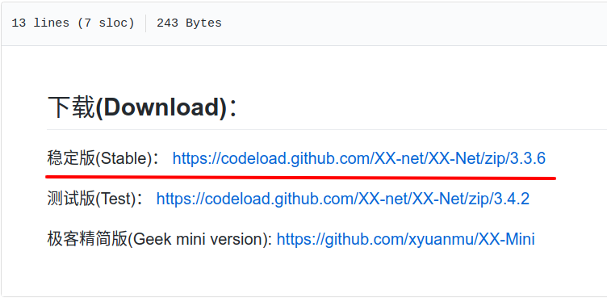
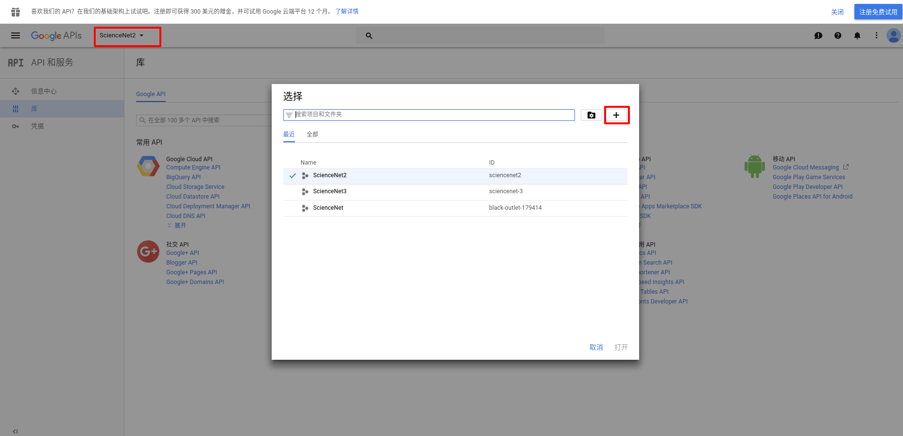
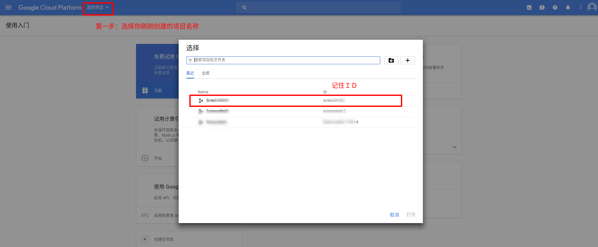
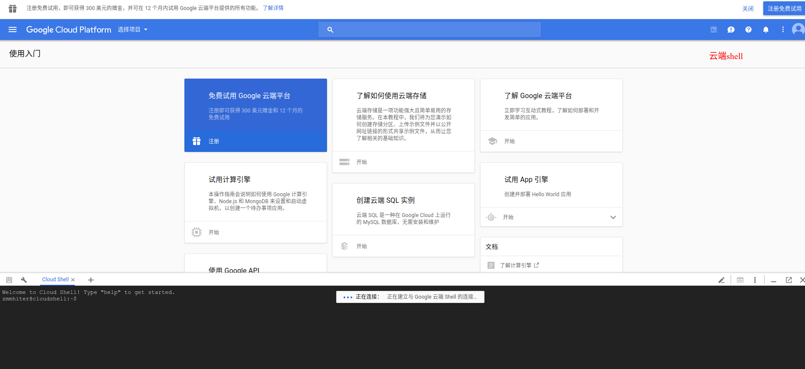

## github下载  
[github地址](https://github.com/XX-net/XX-Net.git)  
[稳定版下载](https://codeload.github.com/XX-net/XX-Net/zip/3.3.6)  

----------------------------------------------
## 谷歌配置
源自:   
(1)[http://blog.csdn.net/yueruitao/article/details/70216799]   
(2)[http://www.cnblogs.com/LangZXG/p/7141194.html?utm_source=itdadao&utm_medium=referral]  

- [创建AppID](https://console.developers.google.com)  

随便取一个项目名  
- [设置AppID的App引擎](https://console.cloud.google.com/start)  

- 配置云端shell  
` gcloud config set project 项目ID `  
`gcloud beta app create --region us-central`   
当底部出现 Success! The app is now created. Please use 'gcloud app deploy' to deploy your first app. 时，创建appid成功。此时可以重复前面两步，创建更多的appid。   
-------------------------------------------
## Linux 配置
在XXnet目录下
`sudo ./start`

1. 弹出页面点击左侧的[部署服务器]粘贴appid，点击[开始部署]（注意谷歌浏览器可能默认阻止弹出式窗口，此处点击网址左侧的感叹号需要允许弹出）（此时需要保证能科学上网，否则可能一直卡在正在部署），在弹出的页面中点击允许。  
如果是火狐浏览器弹出登陆窗口，最好将网址复制到chrome中。  
2. 然后点击[配置]，在[GAE AppID]输入id,[保存]。
2. 打开XX-Net下的SwitchyOmega文件夹，打开谷歌浏览器的扩展程序页面chrome://extensions。把SwitchyOmega.crx文件拖放到浏览器扩展程序页面安装。点击[添加扩展程序]。  
3. 在SwitchyOmega页面，点击[导入导出]，选择[从备份文件恢复]，选择刚刚打开的SwitchyOmega文件夹，选择OmegaOptions.bak文件.  
4. 选择情景模式中的XX-Net自动切换，跳过教程。点击[立即更新情景模式]  
5. 在浏览器右上角点击小圆点，选择[XX-Net自动切换]  

